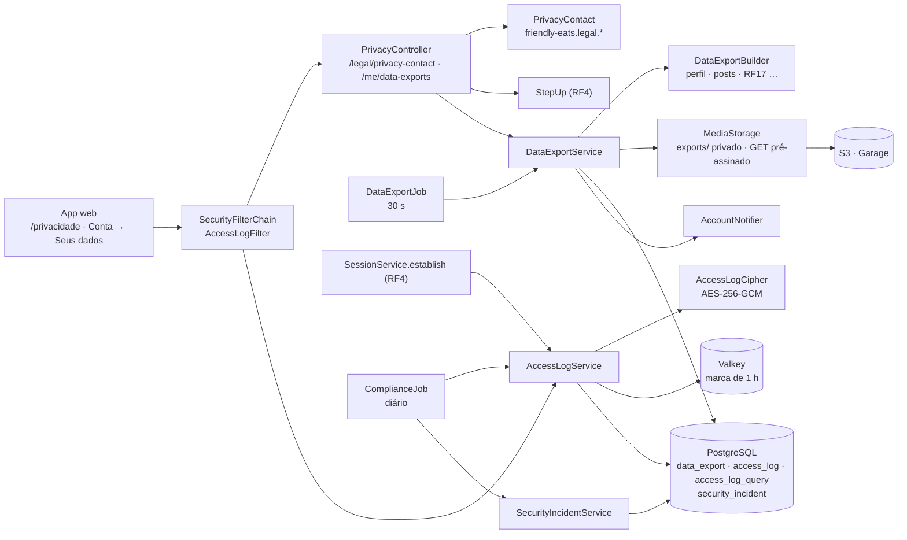

# RF18 · Componentes

```mermaid
flowchart LR
    APP["App web<br/>/privacidade · Conta → Seus dados"] --> SEC["SecurityFilterChain<br/>AccessLogFilter"]
    SEC --> PC["PrivacyController<br/>/legal/privacy-contact · /me/data-exports"]
    PC --> PCT["PrivacyContact<br/>friendly-eats.legal.*"]
    PC --> SU["StepUp (RF4)"]
    PC --> DES["DataExportService"]
    JOB1["DataExportJob<br/>30 s"] --> DES
    DES --> DEB["DataExportBuilder<br/>perfil · posts · RF17 …"]
    DES --> ST["MediaStorage<br/>exports/ privado · GET pré-assinado"]
    ST --> S3[("S3 · Garage")]
    SEC --> ALS["AccessLogService"]
    SS["SessionService.establish (RF4)"] --> ALS
    ALS --> CI["AccessLogCipher<br/>AES-256-GCM"]
    ALS --> VK[("Valkey<br/>marca de 1 h")]
    JOB2["ComplianceJob<br/>diário"] --> ALS
    JOB2 --> SIS["SecurityIncidentService"]
    DES & ALS & SIS --> PG[("PostgreSQL<br/>data_export · access_log · access_log_query<br/>security_incident")]
    DES --> NT["AccountNotifier"]
```
