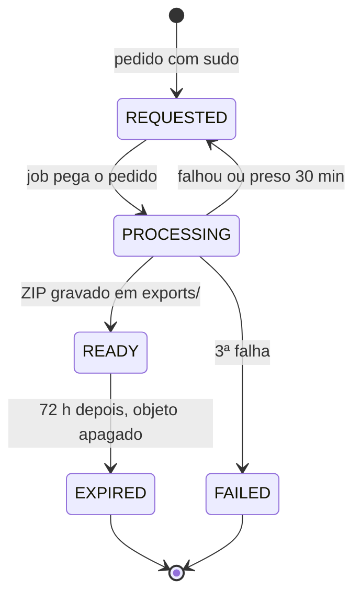
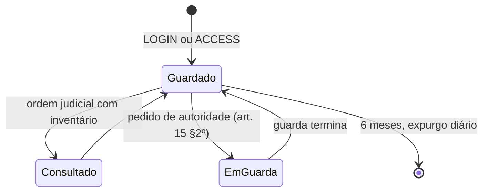
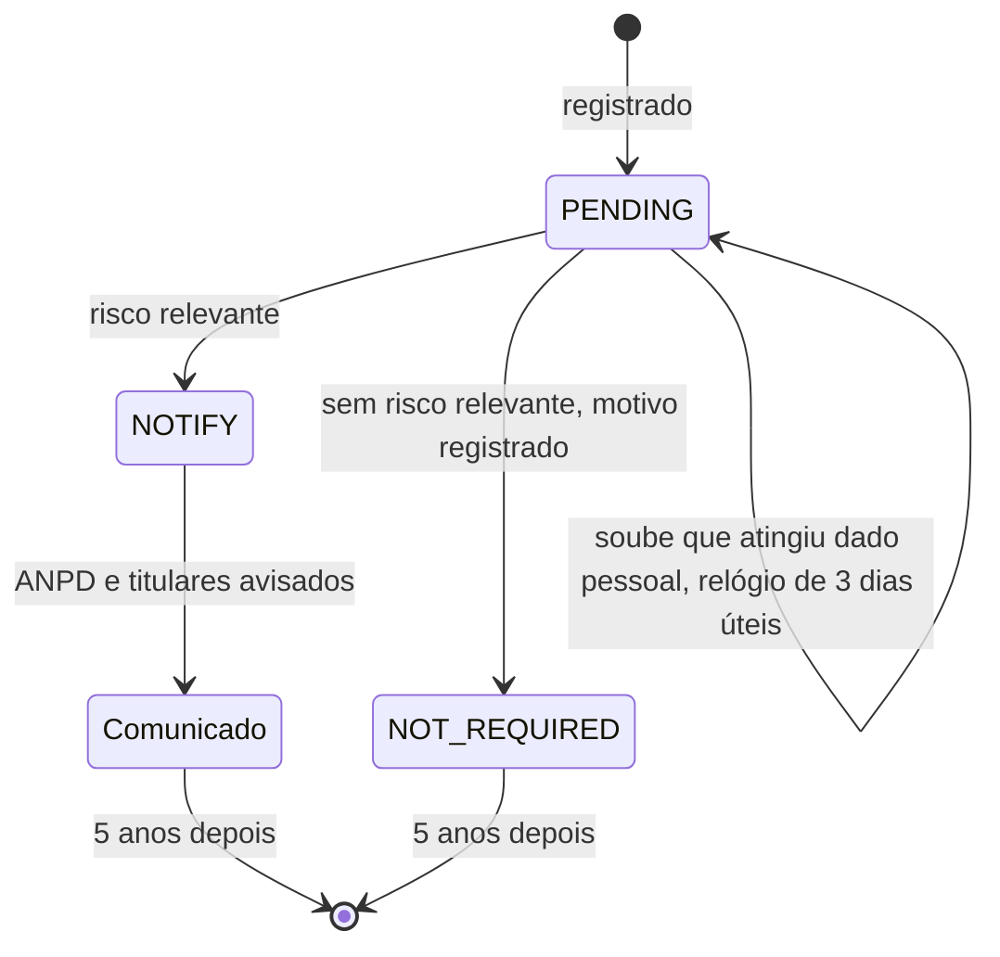

# RF18 · Estados

## Pedido de exportação

```mermaid
stateDiagram-v2
    [*] --> REQUESTED : pedido com sudo
    REQUESTED --> PROCESSING : job pega o pedido
    PROCESSING --> READY : ZIP gravado em exports/
    PROCESSING --> REQUESTED : falhou ou preso 30 min
    PROCESSING --> FAILED : 3ª falha
    READY --> EXPIRED : 72 h depois, objeto apagado
    EXPIRED --> [*]
    FAILED --> [*]
```

## Registro de acesso

```mermaid
stateDiagram-v2
    [*] --> Guardado : LOGIN ou ACCESS
    Guardado --> Consultado : ordem judicial com inventário
    Consultado --> Guardado
    Guardado --> EmGuarda : pedido de autoridade (art. 15 §2º)
    EmGuarda --> Guardado : guarda termina
    Guardado --> [*] : 6 meses, expurgo diário
```

## Incidente

```mermaid
stateDiagram-v2
    [*] --> PENDING : registrado
    PENDING --> PENDING : soube que atingiu dado pessoal, relógio de 3 dias úteis
    PENDING --> NOTIFY : risco relevante
    PENDING --> NOT_REQUIRED : sem risco relevante, motivo registrado
    NOTIFY --> Comunicado : ANPD e titulares avisados
    Comunicado --> [*] : 5 anos depois
    NOT_REQUIRED --> [*] : 5 anos depois
```
