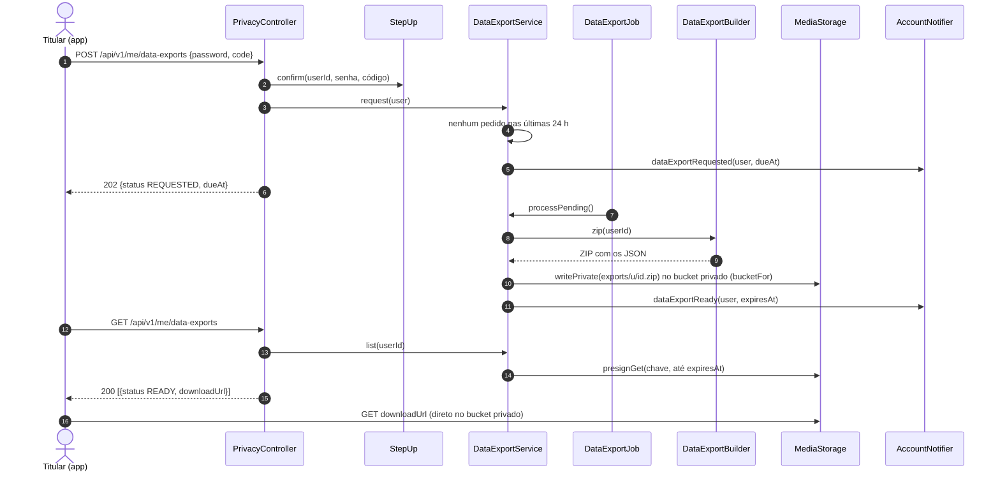
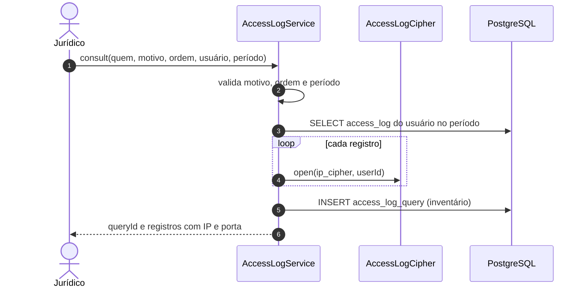

# RF18 · Sequência

## Exportar e baixar

```mermaid
sequenceDiagram
    autonumber
    actor T as Titular (app)
    participant API as PrivacyController
    participant SU as StepUp
    participant S as DataExportService
    participant J as DataExportJob
    participant B as DataExportBuilder
    participant ST as MediaStorage
    participant N as AccountNotifier

    T->>API: POST /api/v1/me/data-exports {password, code}
    API->>SU: confirm(userId, senha, código)
    API->>S: request(user)
    S->>S: nenhum pedido nas últimas 24 h
    S->>N: dataExportRequested(user, dueAt)
    API-->>T: 202 {status REQUESTED, dueAt}
    J->>S: processPending()
    S->>B: zip(userId)
    B-->>S: ZIP com os JSON
    S->>ST: writePrivate(exports/u/id.zip) no bucket privado (bucketFor)
    S->>N: dataExportReady(user, expiresAt)
    T->>API: GET /api/v1/me/data-exports
    API->>S: list(userId)
    S->>ST: presignGet(chave, até expiresAt)
    API-->>T: 200 [{status READY, downloadUrl}]
    T->>ST: GET downloadUrl (direto no bucket privado)
```

## Consulta aos registros de acesso

```mermaid
sequenceDiagram
    autonumber
    actor J as Jurídico
    participant A as AccessLogService
    participant C as AccessLogCipher
    participant DB as PostgreSQL

    J->>A: consult(quem, motivo, ordem, usuário, período)
    A->>A: valida motivo, ordem e período
    A->>DB: SELECT access_log do usuário no período
    loop cada registro
        A->>C: open(ip_cipher, userId)
    end
    A->>DB: INSERT access_log_query (inventário)
    A-->>J: queryId e registros com IP e porta
```
