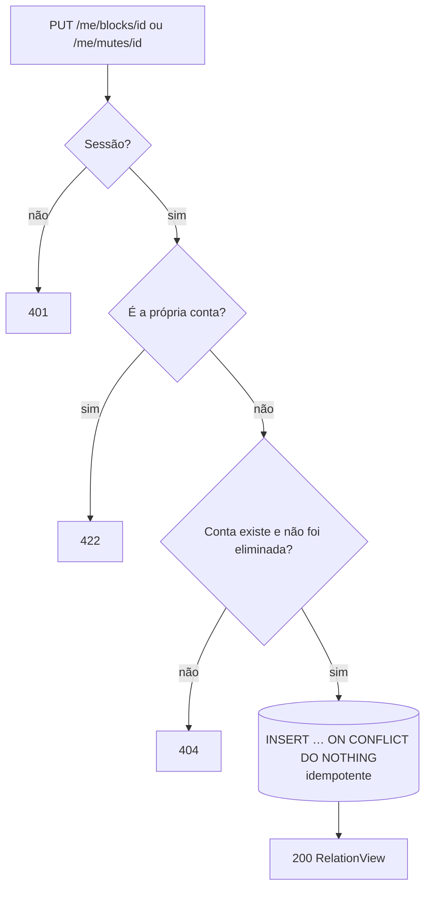
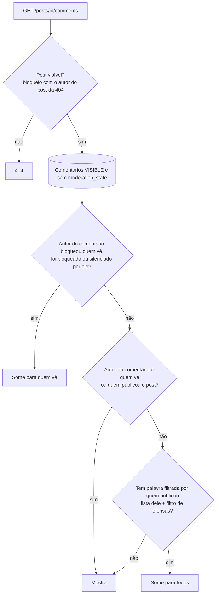
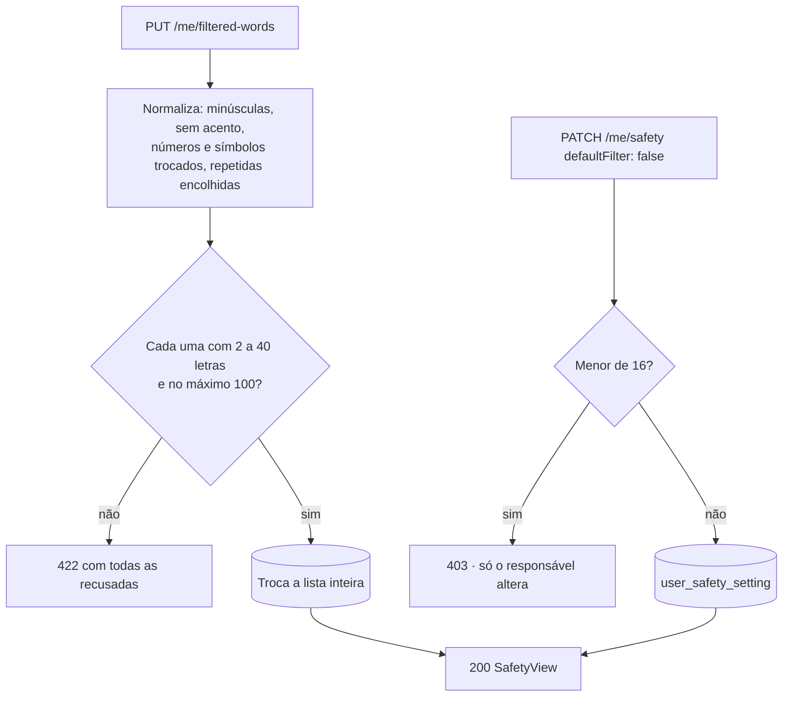

# RF19 · Atividades

## Bloquear ou silenciar

```mermaid
flowchart TD
    A[PUT /me/blocks/id ou /me/mutes/id] --> S{Sessão?}
    S -- não --> E401[401]
    S -- sim --> SELF{É a própria conta?}
    SELF -- sim --> E422[422]
    SELF -- não --> EX{Conta existe e não foi eliminada?}
    EX -- não --> E404[404]
    EX -- sim --> INS[(INSERT … ON CONFLICT DO NOTHING<br/>idempotente)]
    INS --> OK[200 RelationView]
```

## Quem vê um comentário

```mermaid
flowchart TD
    C[GET /posts/id/comments] --> V{Post visível?<br/>bloqueio com o autor do post dá 404}
    V -- não --> E404[404]
    V -- sim --> L[(Comentários VISIBLE e sem moderation_state)]
    L --> B{Autor do comentário bloqueou quem vê,<br/>foi bloqueado ou silenciado por ele?}
    B -- sim --> OUT[Some para quem vê]
    B -- não --> W{Autor do comentário é quem vê<br/>ou quem publicou o post?}
    W -- sim --> SHOW[Mostra]
    W -- não --> F{Tem palavra filtrada por quem publicou<br/>lista dele + filtro de ofensas?}
    F -- sim --> OUT2[Some para todos]
    F -- não --> SHOW
```

## Palavras filtradas

```mermaid
flowchart TD
    P[PUT /me/filtered-words] --> N[Normaliza: minúsculas, sem acento,<br/>números e símbolos trocados, repetidas encolhidas]
    N --> T{Cada uma com 2 a 40 letras<br/>e no máximo 100?}
    T -- não --> E422[422 com todas as recusadas]
    T -- sim --> R[(Troca a lista inteira)]
    R --> OK[200 SafetyView]
    D[PATCH /me/safety defaultFilter: false] --> M{Menor de 16?}
    M -- sim --> E403[403 · só o responsável altera]
    M -- não --> G[(user_safety_setting)] --> OK
```
