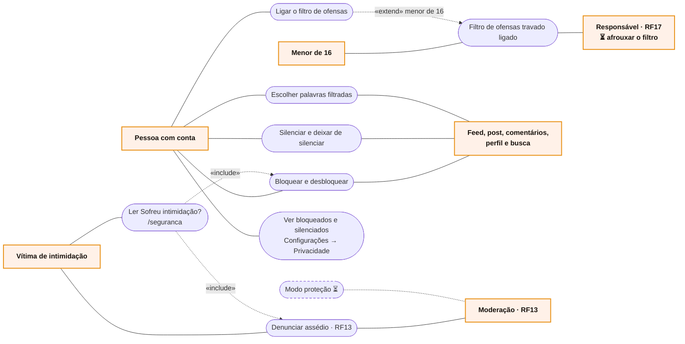

# RF19 · Casos de uso

Atores primários à esquerda, secundários à direita.

```mermaid
flowchart LR
    PES["Pessoa com conta"]:::actor
    MEN["Menor de 16"]:::actor
    VIT["Vítima de intimidação"]:::actor

    UC1(["Bloquear e desbloquear"])
    UC2(["Silenciar e deixar de silenciar"])
    UC3(["Escolher palavras filtradas"])
    UC4(["Ligar o filtro de ofensas"])
    UC5(["Ver bloqueados e silenciados<br/>Configurações → Privacidade"])
    UC6(["Ler Sofreu intimidação?<br/>/seguranca"])
    UC7(["Denunciar assédio · RF13"])
    UC8(["Filtro de ofensas travado ligado"])
    UC9(["Modo proteção ⏳"]):::planned

    FEED["Feed, post, comentários,<br/>perfil e busca"]:::actor
    MOD["Moderação · RF13"]:::actor
    RESP["Responsável · RF17<br/>⏳ afrouxar o filtro"]:::actor

    PES --- UC1 & UC2 & UC3 & UC4 & UC5
    MEN --- UC8
    VIT --- UC6 & UC7
    UC6 -. «include» .-> UC1
    UC6 -. «include» .-> UC7
    UC4 -. «extend» menor de 16 .-> UC8
    UC1 & UC2 & UC3 --- FEED
    UC7 --- MOD
    UC8 --- RESP
    UC9 -.- MOD

    classDef actor fill:#FFF1E8,stroke:#E88F12,stroke-width:2px,color:#17120D,font-weight:bold
    classDef planned stroke-dasharray:5 4
```

Ninguém é avisado de que foi bloqueado ou silenciado. As avaliações de lugares continuam públicas mesmo com bloqueio.
