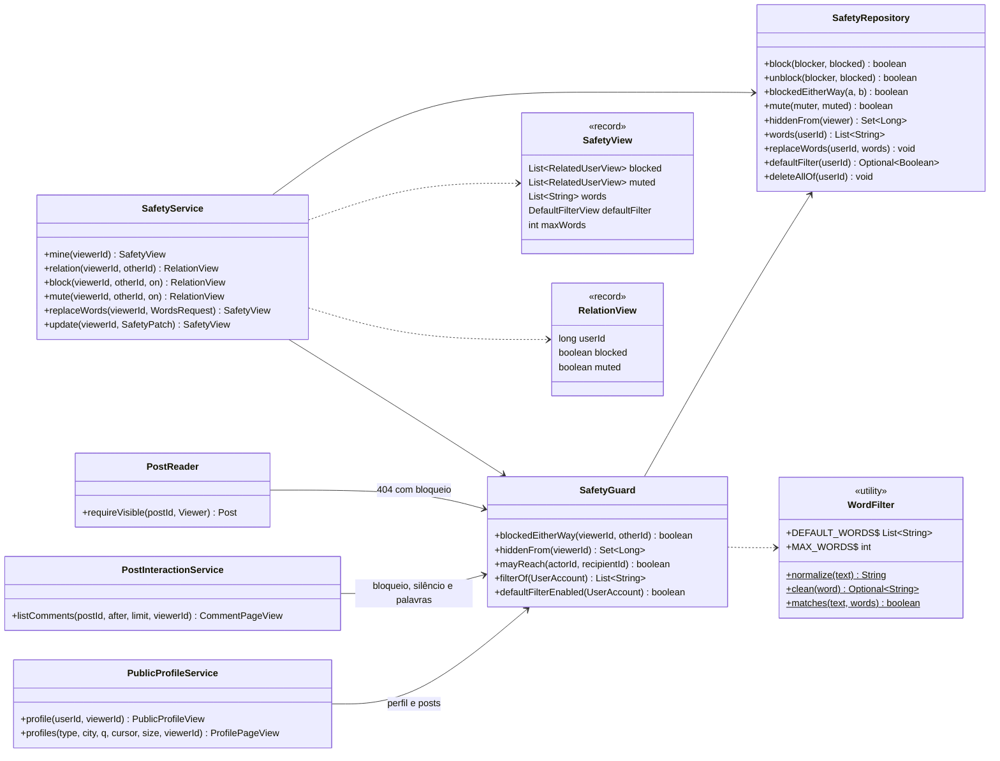

# RF19 · Classes

```mermaid
classDiagram
    direction LR
    class SafetyService {
        +mine(viewerId) SafetyView
        +relation(viewerId, otherId) RelationView
        +block(viewerId, otherId, on) RelationView
        +mute(viewerId, otherId, on) RelationView
        +replaceWords(viewerId, WordsRequest) SafetyView
        +update(viewerId, SafetyPatch) SafetyView
    }
    class SafetyGuard {
        +blockedEitherWay(viewerId, otherId) boolean
        +hiddenFrom(viewerId) Set~Long~
        +mayReach(actorId, recipientId) boolean
        +filterOf(UserAccount) List~String~
        +defaultFilterEnabled(UserAccount) boolean
    }
    class WordFilter {
        <<utility>>
        +DEFAULT_WORDS$ List~String~
        +MAX_WORDS$ int
        +normalize(text)$ String
        +clean(word)$ Optional~String~
        +matches(text, words)$ boolean
    }
    class SafetyRepository {
        +block(blocker, blocked) boolean
        +unblock(blocker, blocked) boolean
        +blockedEitherWay(a, b) boolean
        +mute(muter, muted) boolean
        +hiddenFrom(viewer) Set~Long~
        +words(userId) List~String~
        +replaceWords(userId, words) void
        +defaultFilter(userId) Optional~Boolean~
        +deleteAllOf(userId) void
    }
    class SafetyView {
        <<record>>
        List~RelatedUserView~ blocked
        List~RelatedUserView~ muted
        List~String~ words
        DefaultFilterView defaultFilter
        int maxWords
    }
    class RelationView {
        <<record>>
        long userId
        boolean blocked
        boolean muted
    }
    class PostReader {
        +requireVisible(postId, Viewer) Post
    }
    class PostInteractionService {
        +listComments(postId, after, limit, viewerId) CommentPageView
    }
    class PublicProfileService {
        +profile(userId, viewerId) PublicProfileView
        +profiles(type, city, q, cursor, size, viewerId) ProfilePageView
    }
    SafetyService --> SafetyRepository
    SafetyService --> SafetyGuard
    SafetyGuard --> SafetyRepository
    SafetyGuard ..> WordFilter
    SafetyService ..> SafetyView
    SafetyService ..> RelationView
    PostReader --> SafetyGuard : 404 com bloqueio
    PostInteractionService --> SafetyGuard : bloqueio, silêncio e palavras
    PublicProfileService --> SafetyGuard : perfil e posts
```
