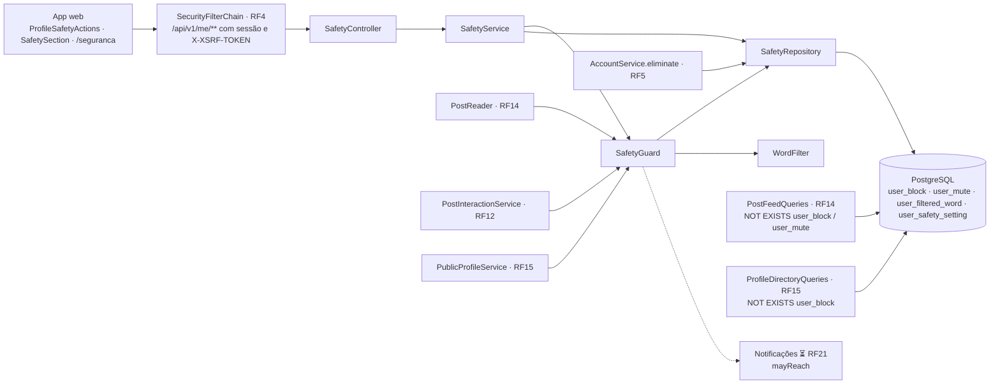

# RF19 · Componentes

```mermaid
flowchart LR
    APP["App web<br/>ProfileSafetyActions · SafetySection · /seguranca"] --> SEC["SecurityFilterChain · RF4<br/>/api/v1/me/** com sessão e X-XSRF-TOKEN"]
    SEC --> SC["SafetyController"]
    SC --> SS["SafetyService"]
    SS --> SG["SafetyGuard"]
    SS & SG --> SR["SafetyRepository"]
    SG --> WF["WordFilter"]
    PR["PostReader · RF14"] --> SG
    IS["PostInteractionService · RF12"] --> SG
    PP["PublicProfileService · RF15"] --> SG
    FQ["PostFeedQueries · RF14<br/>NOT EXISTS user_block / user_mute"] --> PG
    DQ["ProfileDirectoryQueries · RF15<br/>NOT EXISTS user_block"] --> PG
    AS["AccountService.eliminate · RF5"] --> SR
    SR --> PG[("PostgreSQL<br/>user_block · user_mute · user_filtered_word · user_safety_setting")]
    SG -.-> NT["Notificações ⏳ RF21<br/>mayReach"]
```
