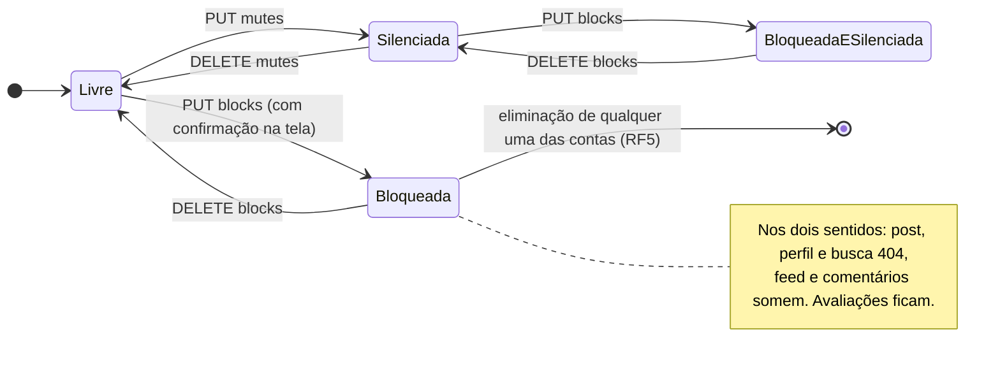
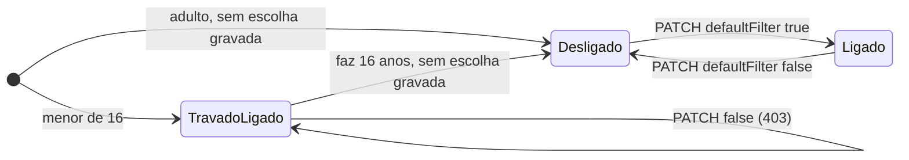

# RF19 · Estados

## Relação entre duas contas (do ponto de vista de quem age)

```mermaid
stateDiagram-v2
    direction LR
    [*] --> Livre
    Livre --> Silenciada : PUT mutes
    Silenciada --> Livre : DELETE mutes
    Livre --> Bloqueada : PUT blocks (com confirmação na tela)
    Silenciada --> BloqueadaESilenciada : PUT blocks
    Bloqueada --> Livre : DELETE blocks
    BloqueadaESilenciada --> Silenciada : DELETE blocks
    Bloqueada --> [*] : eliminação de qualquer uma das contas (RF5)
    note right of Bloqueada
        Nos dois sentidos: post, perfil e busca 404,
        feed e comentários somem. Avaliações ficam.
    end note
```

## Filtro de ofensas

```mermaid
stateDiagram-v2
    direction LR
    [*] --> Desligado : adulto, sem escolha gravada
    [*] --> TravadoLigado : menor de 16
    Desligado --> Ligado : PATCH defaultFilter true
    Ligado --> Desligado : PATCH defaultFilter false
    TravadoLigado --> TravadoLigado : PATCH false (403)
    TravadoLigado --> Desligado : faz 16 anos, sem escolha gravada
```
