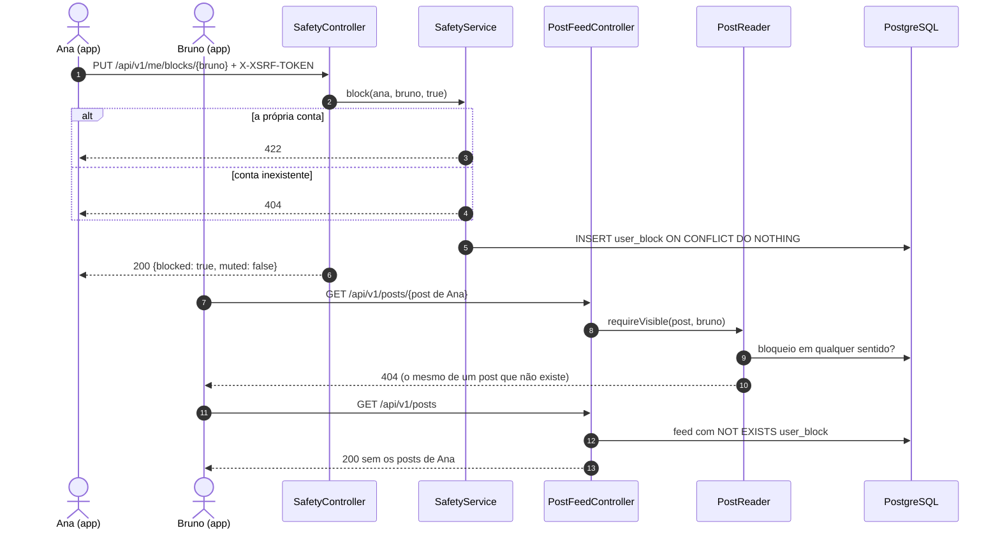
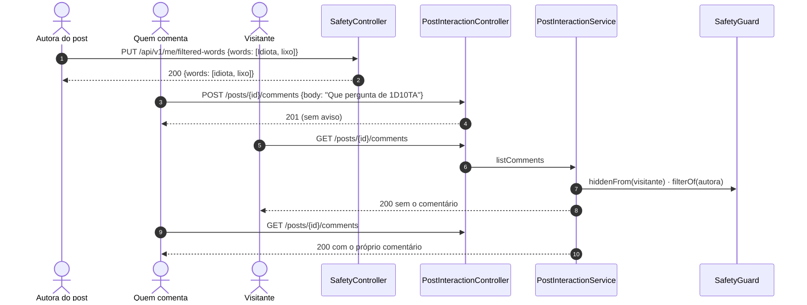

# RF19 · Sequência

## Bloquear e o efeito no post

```mermaid
sequenceDiagram
    autonumber
    actor A as Ana (app)
    actor B as Bruno (app)
    participant SC as SafetyController
    participant SS as SafetyService
    participant PC as PostFeedController
    participant PR as PostReader
    participant DB as PostgreSQL

    A->>SC: PUT /api/v1/me/blocks/{bruno} + X-XSRF-TOKEN
    SC->>SS: block(ana, bruno, true)
    alt a própria conta
        SS-->>A: 422
    else conta inexistente
        SS-->>A: 404
    end
    SS->>DB: INSERT user_block ON CONFLICT DO NOTHING
    SC-->>A: 200 {blocked: true, muted: false}
    B->>PC: GET /api/v1/posts/{post de Ana}
    PC->>PR: requireVisible(post, bruno)
    PR->>DB: bloqueio em qualquer sentido?
    PR-->>B: 404 (o mesmo de um post que não existe)
    B->>PC: GET /api/v1/posts
    PC->>DB: feed com NOT EXISTS user_block
    PC-->>B: 200 sem os posts de Ana
```

## Palavras filtradas nos comentários

```mermaid
sequenceDiagram
    autonumber
    actor A as Autora do post
    actor C as Quem comenta
    actor V as Visitante
    participant SC as SafetyController
    participant IC as PostInteractionController
    participant IS as PostInteractionService
    participant SG as SafetyGuard

    A->>SC: PUT /api/v1/me/filtered-words {words: [Idiota, lixo]}
    SC-->>A: 200 {words: [idiota, lixo]}
    C->>IC: POST /posts/{id}/comments {body: "Que pergunta de 1D10TA"}
    IC-->>C: 201 (sem aviso)
    V->>IC: GET /posts/{id}/comments
    IC->>IS: listComments
    IS->>SG: hiddenFrom(visitante) · filterOf(autora)
    IS-->>V: 200 sem o comentário
    C->>IC: GET /posts/{id}/comments
    IS-->>C: 200 com o próprio comentário
```
