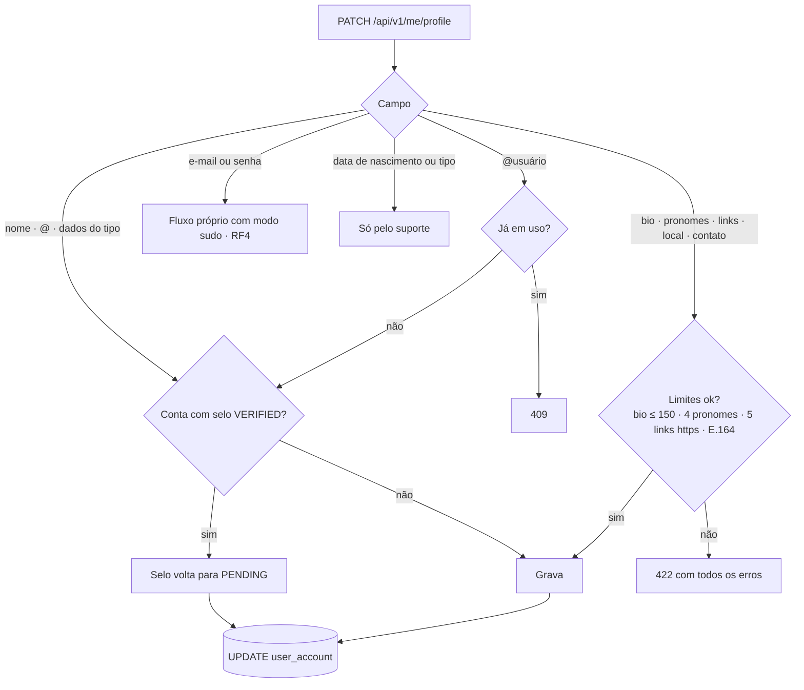
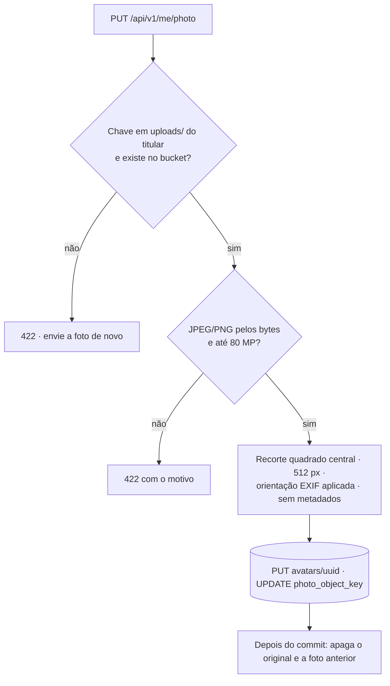

# RF2 · Atividades

## O que muda junto com cada campo do perfil

```mermaid
flowchart TD
    A[PATCH /api/v1/me/profile] --> B{Campo}
    B -- nome · @ · dados do tipo --> C{Conta com selo VERIFIED?}
    C -- sim --> C1[Selo volta para PENDING]
    C -- não --> C2[Grava]
    B -- "@usuário" --> D{Já em uso?}
    D -- sim --> E409[409]
    D -- não --> C
    B -- bio · pronomes · links · local · contato --> F{Limites ok?<br/>bio ≤ 150 · 4 pronomes · 5 links https · E.164}
    F -- não --> E422[422 com todos os erros]
    F -- sim --> C2
    B -- e-mail ou senha --> G[Fluxo próprio com modo sudo · RF4]
    B -- data de nascimento ou tipo --> H[Só pelo suporte]
    C1 & C2 --> L[(UPDATE user_account)]
```

## Trocar a foto

```mermaid
flowchart TD
    P[PUT /api/v1/me/photo] --> K{Chave em uploads/ do titular<br/>e existe no bucket?}
    K -- não --> X[422 · envie a foto de novo]
    K -- sim --> F{JPEG/PNG pelos bytes<br/>e até 80 MP?}
    F -- não --> X2[422 com o motivo]
    F -- sim --> R[Recorte quadrado central · 512 px ·<br/>orientação EXIF aplicada · sem metadados]
    R --> W[(PUT avatars/uuid · UPDATE photo_object_key)]
    W --> D[Depois do commit: apaga o original e a foto anterior]
```
