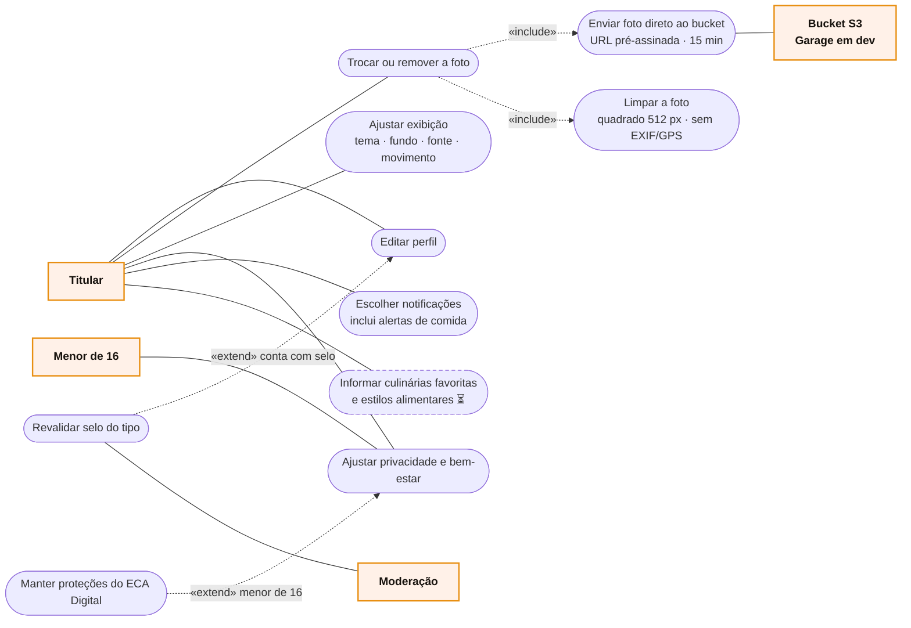

# RF2 · Casos de uso

```mermaid
flowchart LR
    T["Titular"]:::actor
    M["Menor de 16"]:::actor

    UC1(["Editar perfil"])
    UC2(["Trocar ou remover a foto"])
    UC3(["Enviar foto direto ao bucket<br/>URL pré-assinada · 15 min"])
    UC4(["Limpar a foto<br/>quadrado 512 px · sem EXIF/GPS"])
    UC5(["Ajustar exibição<br/>tema · fundo · fonte · movimento"])
    UC6(["Ajustar privacidade e bem-estar"])
    UC7(["Escolher notificações<br/>inclui alertas de comida"])
    UC8(["Revalidar selo do tipo"])
    UC9(["Manter proteções do ECA Digital"])
    UC10(["Informar culinárias favoritas<br/>e estilos alimentares ⏳"]):::planned

    S3["Bucket S3<br/>Garage em dev"]:::actor
    MOD["Moderação"]:::actor

    T --- UC1 & UC2 & UC5 & UC6 & UC7 & UC10
    M --- UC6
    UC2 -. «include» .-> UC3
    UC2 -. «include» .-> UC4
    UC8 -. «extend» conta com selo .-> UC1
    UC9 -. «extend» menor de 16 .-> UC6
    UC3 --- S3
    UC8 --- MOD

    classDef actor fill:#FFF1E8,stroke:#E88F12,stroke-width:2px,color:#17120D,font-weight:bold
    classDef planned stroke-dasharray:5 4
```
