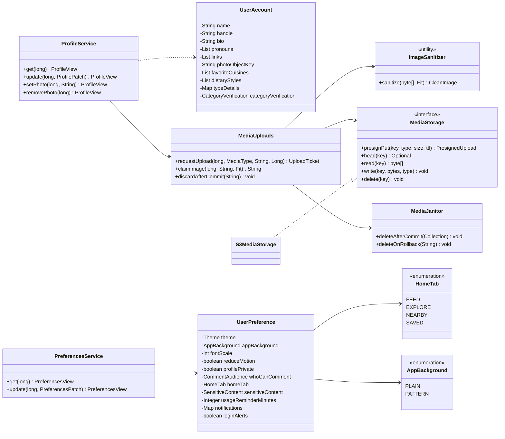

# RF2 · Classes

```mermaid
classDiagram
    direction LR
    class UserAccount {
        -String name
        -String handle
        -String bio
        -List pronouns
        -List links
        -String photoObjectKey
        -List favoriteCuisines
        -List dietaryStyles
        -Map typeDetails
        -CategoryVerification categoryVerification
    }
    class UserPreference {
        -Theme theme
        -AppBackground appBackground
        -int fontScale
        -boolean reduceMotion
        -boolean profilePrivate
        -CommentAudience whoCanComment
        -HomeTab homeTab
        -SensitiveContent sensitiveContent
        -Integer usageReminderMinutes
        -Map notifications
        -boolean loginAlerts
    }
    class HomeTab {
        <<enumeration>>
        FEED
        EXPLORE
        NEARBY
        SAVED
    }
    class AppBackground {
        <<enumeration>>
        PLAIN
        PATTERN
    }
    class ProfileService {
        +get(long) ProfileView
        +update(long, ProfilePatch) ProfileView
        +setPhoto(long, String) ProfileView
        +removePhoto(long) ProfileView
    }
    class PreferencesService {
        +get(long) PreferencesView
        +update(long, PreferencesPatch) PreferencesView
    }
    class MediaUploads {
        +requestUpload(long, MediaType, String, Long) UploadTicket
        +claimImage(long, String, Fit) String
        +discardAfterCommit(String) void
    }
    class ImageSanitizer {
        <<utility>>
        +sanitize(byte[], Fit)$ CleanImage
    }
    class MediaStorage {
        <<interface>>
        +presignPut(key, type, size, ttl) PresignedUpload
        +head(key) Optional
        +read(key) byte[]
        +write(key, bytes, type) void
        +delete(key) void
    }
    class S3MediaStorage
    class MediaJanitor {
        +deleteAfterCommit(Collection) void
        +deleteOnRollback(String) void
    }
    UserPreference --> HomeTab
    UserPreference --> AppBackground
    ProfileService --> MediaUploads
    ProfileService ..> UserAccount
    PreferencesService ..> UserPreference
    MediaUploads --> ImageSanitizer
    MediaUploads --> MediaStorage
    MediaUploads --> MediaJanitor
    S3MediaStorage ..|> MediaStorage
```
