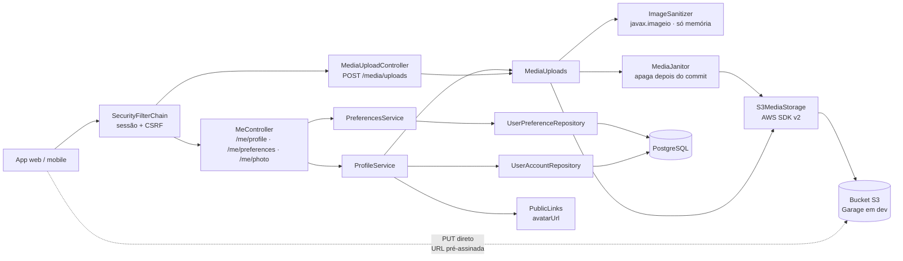

# RF2 · Componentes

```mermaid
flowchart LR
    APP["App web / mobile"] --> SEC["SecurityFilterChain<br/>sessão + CSRF"]
    APP -. "PUT direto<br/>URL pré-assinada" .-> S3[("Bucket S3<br/>Garage em dev")]
    SEC --> MC["MeController<br/>/me/profile · /me/preferences · /me/photo"]
    SEC --> UC["MediaUploadController<br/>POST /media/uploads"]
    MC --> PS["ProfileService"]
    MC --> PFS["PreferencesService"]
    UC --> MU["MediaUploads"]
    PS --> MU
    MU --> IS["ImageSanitizer<br/>javax.imageio · só memória"]
    MU --> MJ["MediaJanitor<br/>apaga depois do commit"]
    MU --> MS["S3MediaStorage<br/>AWS SDK v2"]
    MJ --> MS
    MS --> S3
    PS --> UR["UserAccountRepository"]
    PFS --> PR["UserPreferenceRepository"]
    UR & PR --> PG[("PostgreSQL")]
    PS --> PL["PublicLinks<br/>avatarUrl"]
```
