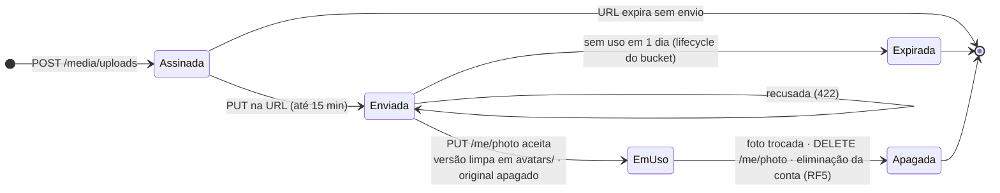
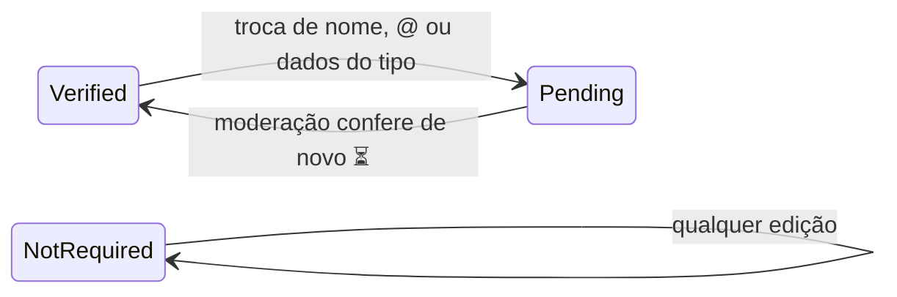
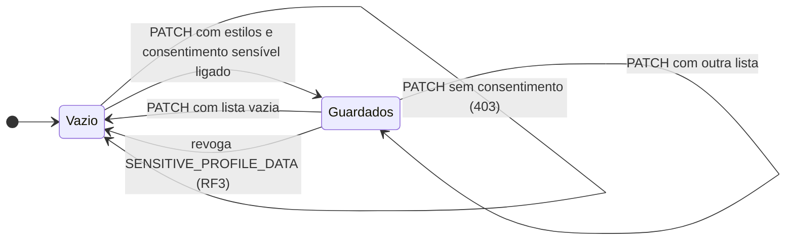

# RF2 · Estados

## Foto no bucket

```mermaid
stateDiagram-v2
    direction LR
    [*] --> Assinada : POST /media/uploads
    Assinada --> Enviada : PUT na URL (até 15 min)
    Assinada --> [*] : URL expira sem envio
    Enviada --> EmUso : PUT /me/photo aceita<br/>versão limpa em avatars/ · original apagado
    Enviada --> Enviada : recusada (422)
    Enviada --> Expirada : sem uso em 1 dia (lifecycle do bucket)
    EmUso --> Apagada : foto trocada · DELETE /me/photo · eliminação da conta (RF5)
    Expirada --> [*]
    Apagada --> [*]
```

## Selo ao editar o perfil

```mermaid
stateDiagram-v2
    direction LR
    Verified --> Pending : troca de nome, @ ou dados do tipo
    Pending --> Verified : moderação confere de novo ⏳
    NotRequired --> NotRequired : qualquer edição
```

## Estilos alimentares no perfil

```mermaid
stateDiagram-v2
    direction LR
    [*] --> Vazio
    Vazio --> Guardados : PATCH com estilos e consentimento sensível ligado
    Guardados --> Guardados : PATCH com outra lista
    Guardados --> Vazio : PATCH com lista vazia
    Guardados --> Vazio : revoga SENSITIVE_PROFILE_DATA (RF3)
    Vazio --> Vazio : PATCH sem consentimento (403)
```
