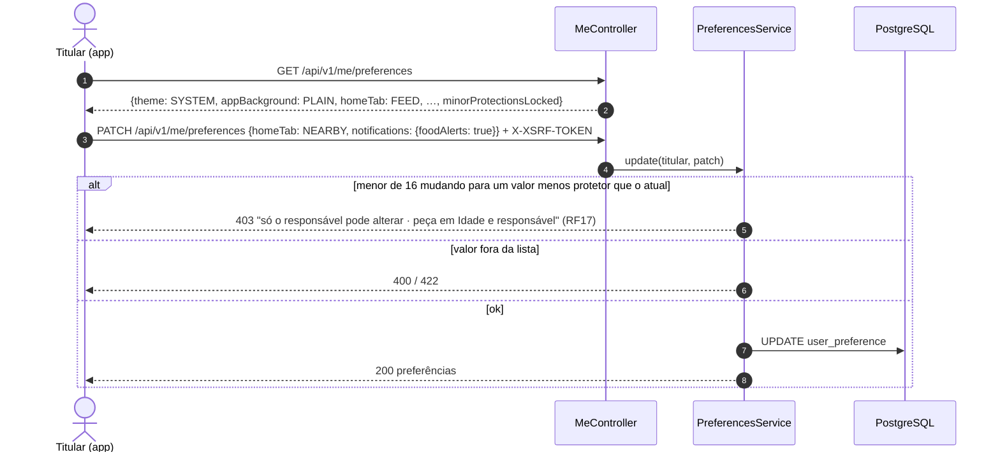
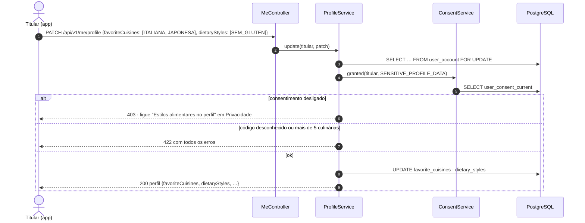
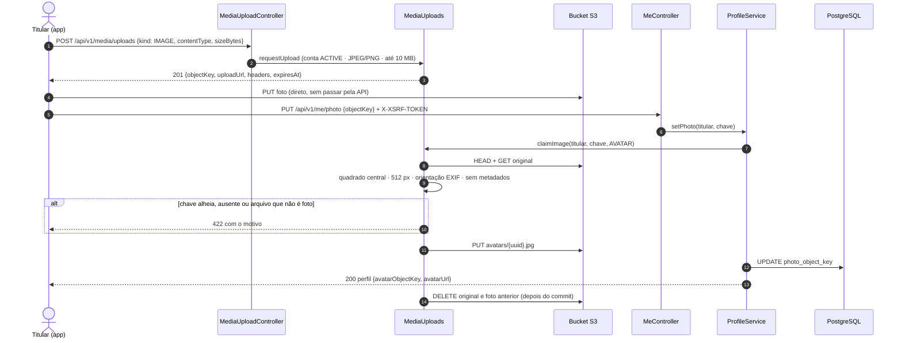

# RF2 · Sequência

## Editar preferências

```mermaid
sequenceDiagram
    autonumber
    actor T as Titular (app)
    participant API as MeController
    participant S as PreferencesService
    participant DB as PostgreSQL

    T->>API: GET /api/v1/me/preferences
    API-->>T: {theme: SYSTEM, appBackground: PLAIN, homeTab: FEED, …, minorProtectionsLocked}
    T->>API: PATCH /api/v1/me/preferences {homeTab: NEARBY, notifications: {foodAlerts: true}} + X-XSRF-TOKEN
    API->>S: update(titular, patch)
    alt menor de 16 mudando para um valor menos protetor que o atual
        S-->>T: 403 "só o responsável pode alterar · peça em Idade e responsável" (RF17)
    else valor fora da lista
        S-->>T: 400 / 422
    else ok
        S->>DB: UPDATE user_preference
        S-->>T: 200 preferências
    end
```

## Informar o gosto

```mermaid
sequenceDiagram
    autonumber
    actor T as Titular (app)
    participant API as MeController
    participant P as ProfileService
    participant C as ConsentService
    participant DB as PostgreSQL

    T->>API: PATCH /api/v1/me/profile {favoriteCuisines: [ITALIANA, JAPONESA], dietaryStyles: [SEM_GLUTEN]}
    API->>P: update(titular, patch)
    P->>DB: SELECT … FROM user_account FOR UPDATE
    P->>C: granted(titular, SENSITIVE_PROFILE_DATA)
    C->>DB: SELECT user_consent_current
    alt consentimento desligado
        P-->>T: 403 · ligue "Estilos alimentares no perfil" em Privacidade
    else código desconhecido ou mais de 5 culinárias
        P-->>T: 422 com todos os erros
    else ok
        P->>DB: UPDATE favorite_cuisines · dietary_styles
        P-->>T: 200 perfil {favoriteCuisines, dietaryStyles, …}
    end
```

## Trocar a foto de perfil

```mermaid
sequenceDiagram
    autonumber
    actor T as Titular (app)
    participant UC as MediaUploadController
    participant MU as MediaUploads
    participant S3 as Bucket S3
    participant API as MeController
    participant P as ProfileService
    participant DB as PostgreSQL

    T->>UC: POST /api/v1/media/uploads {kind: IMAGE, contentType, sizeBytes}
    UC->>MU: requestUpload (conta ACTIVE · JPEG/PNG · até 10 MB)
    MU-->>T: 201 {objectKey, uploadUrl, headers, expiresAt}
    T->>S3: PUT foto (direto, sem passar pela API)
    T->>API: PUT /api/v1/me/photo {objectKey} + X-XSRF-TOKEN
    API->>P: setPhoto(titular, chave)
    P->>MU: claimImage(titular, chave, AVATAR)
    MU->>S3: HEAD + GET original
    MU->>MU: quadrado central · 512 px · orientação EXIF · sem metadados
    alt chave alheia, ausente ou arquivo que não é foto
        MU-->>T: 422 com o motivo
    end
    MU->>S3: PUT avatars/{uuid}.jpg
    P->>DB: UPDATE photo_object_key
    P-->>T: 200 perfil {avatarObjectKey, avatarUrl}
    MU->>S3: DELETE original e foto anterior (depois do commit)
```
