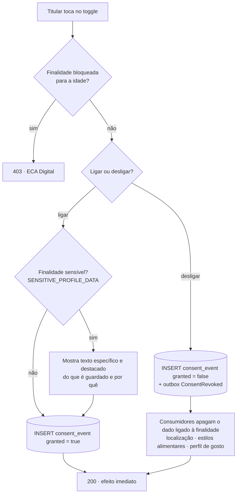

# RF3 · Atividades: mudar um consentimento

```mermaid
flowchart TD
    A[Titular toca no toggle] --> B{Finalidade bloqueada<br/>para a idade?}
    B -- sim --> E403[403 · ECA Digital]
    B -- não --> C{Ligar ou desligar?}
    C -- ligar --> D{Finalidade sensível?<br/>SENSITIVE_PROFILE_DATA}
    D -- sim --> D1[Mostra texto específico e destacado<br/>do que é guardado e por quê]
    D -- não --> G
    D1 --> G[(INSERT consent_event granted = true)]
    C -- desligar --> R[(INSERT consent_event granted = false<br/>+ outbox ConsentRevoked)]
    R --> X[Consumidores apagam o dado ligado à finalidade<br/>localização · estilos alimentares · perfil de gosto]
    G & X --> OK[200 · efeito imediato]
```

As etapas depois do cadastro estão planejadas (⏳); hoje o código grava as 5 finalidades desligadas no cadastro.
