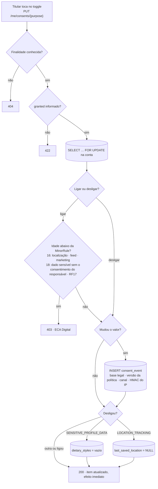
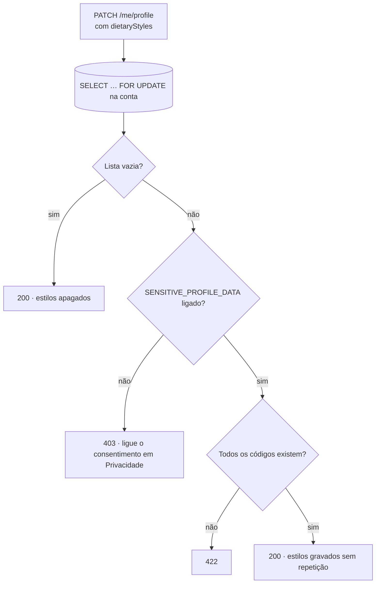

# RF3 · Atividades: mudar um consentimento

```mermaid
flowchart TD
    A["Titular toca no toggle<br/>PUT /me/consents/{purpose}"] --> P{Finalidade conhecida?}
    P -- não --> E404[404]
    P -- sim --> V{granted informado?}
    V -- não --> E422[422]
    V -- sim --> L[(SELECT … FOR UPDATE na conta)]
    L --> C{Ligar ou desligar?}
    C -- ligar --> B{Idade abaixo da MinorRule?<br/>16: localização · feed · marketing<br/>18: dado sensível sem o<br/>consentimento do responsável · RF17}
    B -- sim --> E403[403 · ECA Digital]
    B -- não --> S{Mudou o valor?}
    C -- desligar --> S
    S -- sim --> G[(INSERT consent_event<br/>base legal · versão da política · canal · HMAC do IP)]
    S -- não --> F
    G --> F{Desligou?}
    F -- "SENSITIVE_PROFILE_DATA" --> X1[(dietary_styles = vazio)]
    F -- "LOCATION_TRACKING" --> X2[(last_saved_location = NULL)]
    F -- outra ou ligou --> OK
    X1 & X2 --> OK[200 · item atualizado, efeito imediato]
```

## Atividades: estilos alimentares no perfil (RF2)

```mermaid
flowchart TD
    A["PATCH /me/profile<br/>com dietaryStyles"] --> L[(SELECT … FOR UPDATE na conta)]
    L --> E{Lista vazia?}
    E -- sim --> OK[200 · estilos apagados]
    E -- não --> C{SENSITIVE_PROFILE_DATA ligado?}
    C -- não --> E403[403 · ligue o consentimento em Privacidade]
    C -- sim --> K{Todos os códigos existem?}
    K -- não --> E422[422]
    K -- sim --> OK2[200 · estilos gravados sem repetição]
```
