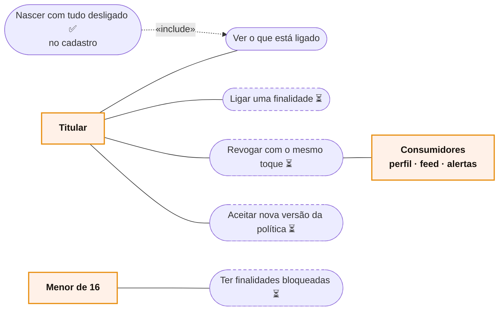

# RF3 · Casos de uso

```mermaid
flowchart LR
    T["Titular"]:::actor
    M["Menor de 16"]:::actor

    UC1(["Ver o que está ligado"])
    UC2(["Ligar uma finalidade ⏳"]):::planned
    UC3(["Revogar com o mesmo toque ⏳"]):::planned
    UC4(["Aceitar nova versão da política ⏳"]):::planned
    UC5(["Nascer com tudo desligado ✅<br/>no cadastro"])
    UC6(["Ter finalidades bloqueadas ⏳"]):::planned

    SYS["Consumidores<br/>perfil · feed · alertas"]:::actor

    T --- UC1 & UC2 & UC3 & UC4
    M --- UC6
    UC5 -. «include» .-> UC1
    UC3 --- SYS

    classDef actor fill:#FFF1E8,stroke:#E88F12,stroke-width:2px,color:#17120D,font-weight:bold
    classDef planned stroke-dasharray:5 4
```
