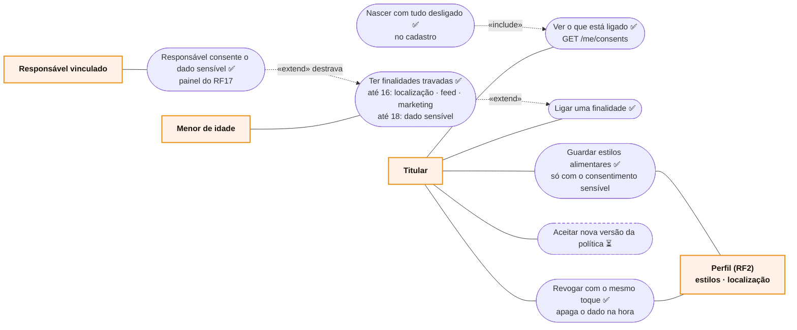

# RF3 · Casos de uso

```mermaid
flowchart LR
    T["Titular"]:::actor
    M["Menor de idade"]:::actor

    UC1(["Ver o que está ligado ✅<br/>GET /me/consents"])
    UC2(["Ligar uma finalidade ✅"])
    UC3(["Revogar com o mesmo toque ✅<br/>apaga o dado na hora"])
    UC4(["Aceitar nova versão da política ⏳"]):::planned
    UC5(["Nascer com tudo desligado ✅<br/>no cadastro"])
    UC6(["Ter finalidades travadas ✅<br/>até 16: localização · feed · marketing<br/>até 18: dado sensível"])
    UC8(["Responsável consente o dado sensível ✅<br/>painel do RF17"])
    RS["Responsável vinculado"]:::actor
    UC7(["Guardar estilos alimentares ✅<br/>só com o consentimento sensível"])

    SYS["Perfil (RF2)<br/>estilos · localização"]:::actor

    T --- UC1 & UC2 & UC3 & UC4 & UC7
    M --- UC6
    RS --- UC8
    UC8 -. «extend» destrava .-> UC6
    UC5 -. «include» .-> UC1
    UC6 -. «extend» .-> UC2
    UC3 --- SYS
    UC7 --- SYS

    classDef actor fill:#FFF1E8,stroke:#E88F12,stroke-width:2px,color:#17120D,font-weight:bold
    classDef planned stroke-dasharray:5 4
```
