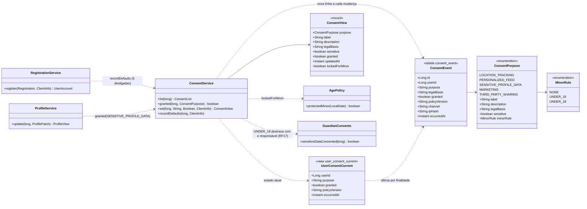

# RF3 · Classes

```mermaid
classDiagram
    direction LR
    class ConsentEvent {
        <<tabela consent_event>>
        +Long id
        +Long userId
        +String purpose
        +String legalBasis
        +boolean granted
        +String policyVersion
        +String channel
        +String ipHash
        +Instant occurredAt
    }
    class UserConsentCurrent {
        <<view user_consent_current>>
        +Long userId
        +String purpose
        +boolean granted
        +String policyVersion
        +Instant occurredAt
    }
    class ConsentPurpose {
        <<enumeration>>
        LOCATION_TRACKING
        PERSONALIZED_FEED
        SENSITIVE_PROFILE_DATA
        MARKETING
        THIRD_PARTY_SHARING
        +String label
        +String description
        +String legalBasis
        +boolean sensitive
        +MinorRule minorRule
    }
    class MinorRule {
        <<enumeration>>
        NONE
        UNDER_16
        UNDER_18
    }
    class ConsentService {
        +list(long) ConsentList
        +granted(long, ConsentPurpose) boolean
        +set(long, String, Boolean, ClientInfo) ConsentView
        +recordDefaults(long, ClientInfo)
    }
    class ConsentView {
        <<record>>
        +ConsentPurpose purpose
        +String label
        +String description
        +String legalBasis
        +boolean sensitive
        +boolean granted
        +Instant updatedAt
        +boolean lockedForMinor
    }
    class RegistrationService {
        +register(Registration, ClientInfo) UserAccount
    }
    class ProfileService {
        +update(long, ProfilePatch) ProfileView
    }
    class AgePolicy {
        +protectedMinor(LocalDate) boolean
    }
    class GuardianConsents {
        +sensitiveDataConsented(long) boolean
    }
    RegistrationService ..> ConsentService : recordDefaults (5 desligadas)
    ProfileService ..> ConsentService : granted(SENSITIVE_PROFILE_DATA)
    ConsentService ..> AgePolicy : lockedForMinor
    ConsentService ..> GuardianConsents : UNDER_18 destrava com o responsável (RF17)
    ConsentService ..> ConsentEvent : nova linha a cada mudança
    ConsentService ..> UserConsentCurrent : estado atual
    ConsentService --> ConsentView
    UserConsentCurrent ..> ConsentEvent : última por finalidade
    ConsentEvent --> ConsentPurpose
    ConsentPurpose --> MinorRule
```
