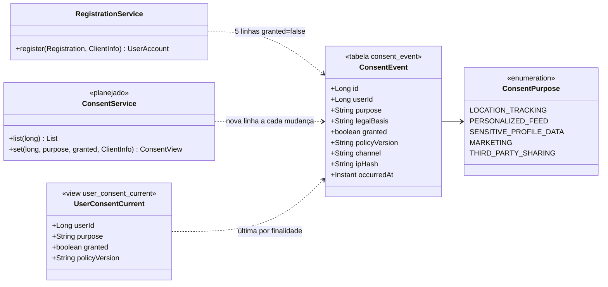

# RF3 · Classes

```mermaid
classDiagram
    direction LR
    class ConsentEvent {
        <<tabela consent_event>>
        +Long id
        +Long userId
        +String purpose
        +String legalBasis
        +boolean granted
        +String policyVersion
        +String channel
        +String ipHash
        +Instant occurredAt
    }
    class UserConsentCurrent {
        <<view user_consent_current>>
        +Long userId
        +String purpose
        +boolean granted
        +String policyVersion
    }
    class ConsentPurpose {
        <<enumeration>>
        LOCATION_TRACKING
        PERSONALIZED_FEED
        SENSITIVE_PROFILE_DATA
        MARKETING
        THIRD_PARTY_SHARING
    }
    class RegistrationService {
        +register(Registration, ClientInfo) UserAccount
    }
    class ConsentService {
        <<planejado>>
        +list(long) List
        +set(long, purpose, granted, ClientInfo) ConsentView
    }
    RegistrationService ..> ConsentEvent : 5 linhas granted=false
    ConsentService ..> ConsentEvent : nova linha a cada mudança
    UserConsentCurrent ..> ConsentEvent : última por finalidade
    ConsentEvent --> ConsentPurpose
```

As finalidades hoje são texto validado pelo `CHECK` da tabela; o enum e o `ConsentService` entram com a API.
