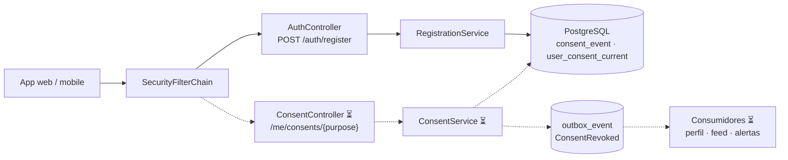

# RF3 · Componentes

```mermaid
flowchart LR
    APP["App web / mobile"] --> SEC["SecurityFilterChain"]
    SEC --> AC["AuthController<br/>POST /auth/register"]
    SEC -.-> CC["ConsentController ⏳<br/>/me/consents/{purpose}"]
    AC --> RS["RegistrationService"]
    CC -.-> CS["ConsentService ⏳"]
    RS --> PG[("PostgreSQL<br/>consent_event · user_consent_current")]
    CS -.-> PG
    CS -.-> OB[("outbox_event<br/>ConsentRevoked")]
    OB -.-> CON["Consumidores ⏳<br/>perfil · feed · alertas"]
```
