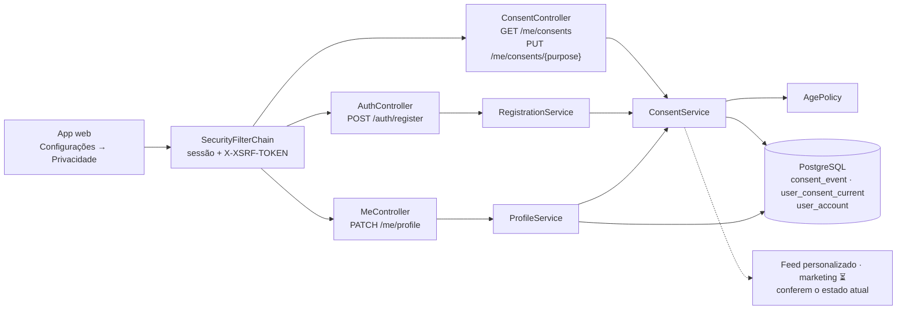

# RF3 · Componentes

```mermaid
flowchart LR
    APP["App web<br/>Configurações → Privacidade"] --> SEC["SecurityFilterChain<br/>sessão + X-XSRF-TOKEN"]
    SEC --> AC["AuthController<br/>POST /auth/register"]
    SEC --> CC["ConsentController<br/>GET /me/consents<br/>PUT /me/consents/{purpose}"]
    SEC --> MC["MeController<br/>PATCH /me/profile"]
    AC --> RS["RegistrationService"]
    CC --> CS["ConsentService"]
    MC --> PS["ProfileService"]
    RS --> CS
    PS --> CS
    CS --> AP["AgePolicy"]
    CS --> PG[("PostgreSQL<br/>consent_event · user_consent_current<br/>user_account")]
    PS --> PG
    CS -.-> CON["Feed personalizado · marketing ⏳<br/>conferem o estado atual"]
```
