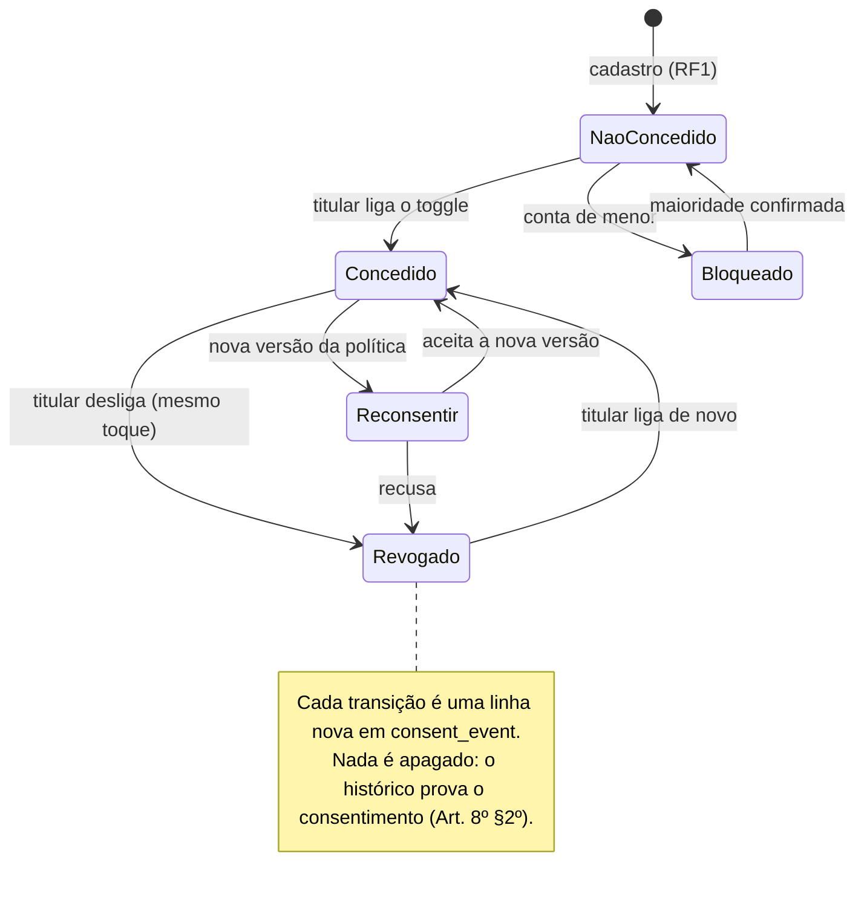

# RF3 · Estados de um consentimento

```mermaid
stateDiagram-v2
    [*] --> NaoConcedido : cadastro (RF1)
    NaoConcedido --> Concedido : titular liga o toggle
    Concedido --> Revogado : titular desliga (mesmo toque)
    Revogado --> Concedido : titular liga de novo
    Concedido --> Reconsentir : nova versão da política
    Reconsentir --> Concedido : aceita a nova versão
    Reconsentir --> Revogado : recusa
    NaoConcedido --> Bloqueado : conta de menor
    Bloqueado --> NaoConcedido : maioridade confirmada
    note right of Revogado
        Cada transição é uma linha nova em consent_event.
        Nada é apagado: o histórico prova o consentimento (Art. 8º §2º).
    end note
```
