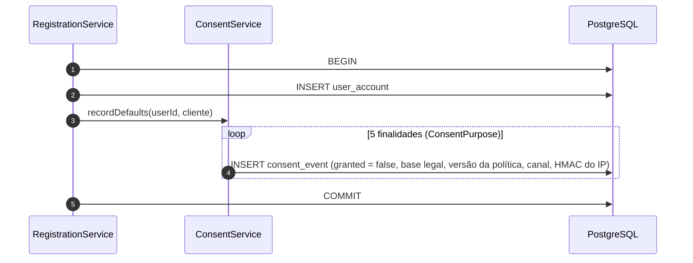
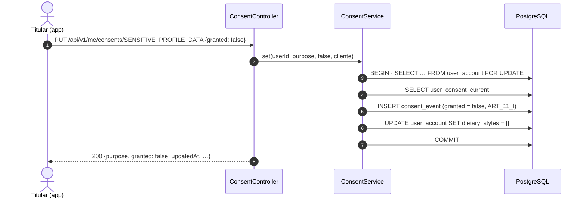
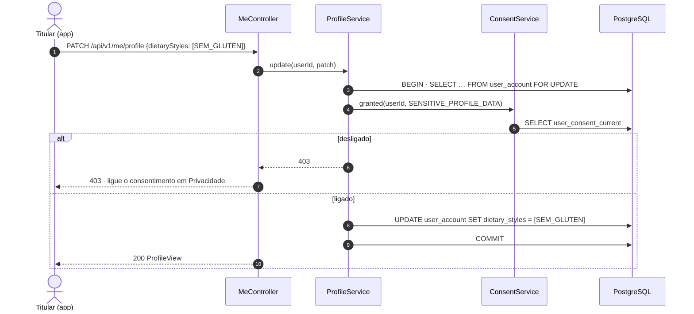

# RF3 · Sequência

## No cadastro

```mermaid
sequenceDiagram
    autonumber
    participant R as RegistrationService
    participant C as ConsentService
    participant DB as PostgreSQL
    R->>DB: BEGIN
    R->>DB: INSERT user_account
    R->>C: recordDefaults(userId, cliente)
    loop 5 finalidades (ConsentPurpose)
        C->>DB: INSERT consent_event (granted = false, base legal, versão da política, canal, HMAC do IP)
    end
    R->>DB: COMMIT
```

## Revogar o consentimento sensível

```mermaid
sequenceDiagram
    autonumber
    actor T as Titular (app)
    participant API as ConsentController
    participant S as ConsentService
    participant DB as PostgreSQL

    T->>API: PUT /api/v1/me/consents/SENSITIVE_PROFILE_DATA {granted: false}
    API->>S: set(userId, purpose, false, cliente)
    S->>DB: BEGIN · SELECT … FROM user_account FOR UPDATE
    S->>DB: SELECT user_consent_current
    S->>DB: INSERT consent_event (granted = false, ART_11_I)
    S->>DB: UPDATE user_account SET dietary_styles = []
    S->>DB: COMMIT
    API-->>T: 200 {purpose, granted: false, updatedAt, …}
```

## Guardar estilos alimentares (RF2)

```mermaid
sequenceDiagram
    autonumber
    actor T as Titular (app)
    participant API as MeController
    participant P as ProfileService
    participant S as ConsentService
    participant DB as PostgreSQL

    T->>API: PATCH /api/v1/me/profile {dietaryStyles: [SEM_GLUTEN]}
    API->>P: update(userId, patch)
    P->>DB: BEGIN · SELECT … FROM user_account FOR UPDATE
    P->>S: granted(userId, SENSITIVE_PROFILE_DATA)
    S->>DB: SELECT user_consent_current
    alt desligado
        P-->>API: 403
        API-->>T: 403 · ligue o consentimento em Privacidade
    else ligado
        P->>DB: UPDATE user_account SET dietary_styles = [SEM_GLUTEN]
        P->>DB: COMMIT
        API-->>T: 200 ProfileView
    end
```
