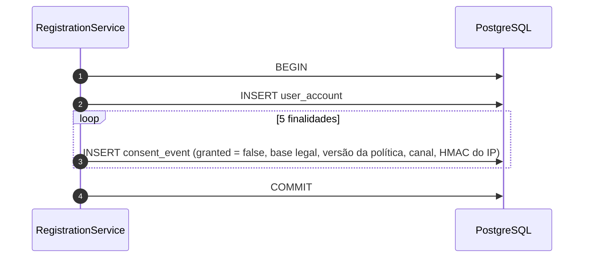
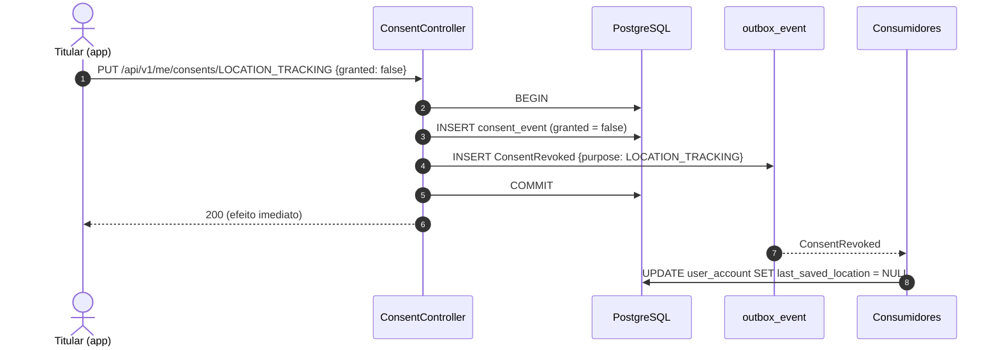

# RF3 · Sequência

## No cadastro (implementado)

```mermaid
sequenceDiagram
    autonumber
    participant R as RegistrationService
    participant DB as PostgreSQL
    R->>DB: BEGIN
    R->>DB: INSERT user_account
    loop 5 finalidades
        R->>DB: INSERT consent_event (granted = false, base legal, versão da política, canal, HMAC do IP)
    end
    R->>DB: COMMIT
```

## Revogar localização (planejado)

```mermaid
sequenceDiagram
    autonumber
    actor T as Titular (app)
    participant API as ConsentController
    participant DB as PostgreSQL
    participant OB as outbox_event
    participant U as Consumidores

    T->>API: PUT /api/v1/me/consents/LOCATION_TRACKING {granted: false}
    API->>DB: BEGIN
    API->>DB: INSERT consent_event (granted = false)
    API->>OB: INSERT ConsentRevoked {purpose: LOCATION_TRACKING}
    API->>DB: COMMIT
    API-->>T: 200 (efeito imediato)
    OB-->>U: ConsentRevoked
    U->>DB: UPDATE user_account SET last_saved_location = NULL
```
