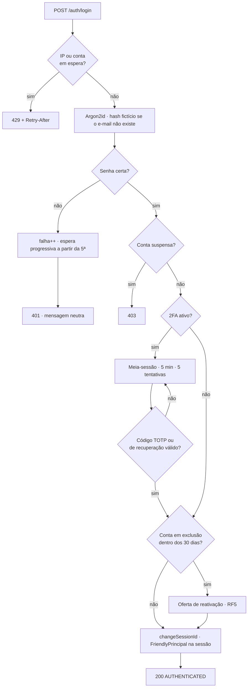
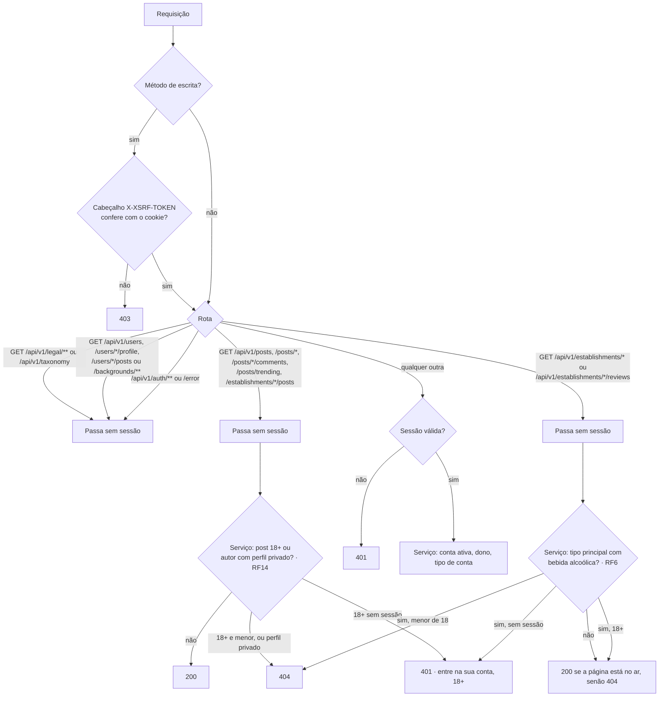

# RF4 · Atividades: login em etapas

```mermaid
flowchart TD
    A[POST /auth/login] --> T{IP ou conta<br/>em espera?}
    T -- sim --> E429[429 + Retry-After]
    T -- não --> H[Argon2id · hash fictício se o e-mail não existe]
    H --> OK{Senha certa?}
    OK -- não --> F[falha++ · espera progressiva a partir da 5ª] --> E401[401 · mensagem neutra]
    OK -- sim --> SU{Conta suspensa?}
    SU -- sim --> E403[403]
    SU -- não --> MFA{2FA ativo?}
    MFA -- sim --> PEND[Meia-sessão · 5 min · 5 tentativas] --> C{Código TOTP ou<br/>de recuperação válido?}
    C -- não --> PEND
    C -- sim --> DEL
    MFA -- não --> DEL{Conta em exclusão<br/>dentro dos 30 dias?}
    DEL -- sim --> RE[Oferta de reativação · RF5]
    DEL -- não --> S[changeSessionId · FriendlyPrincipal na sessão]
    RE --> S
    S --> AUT[200 AUTHENTICATED]
```

## Autorização de uma requisição (`SecurityConfig`)

```mermaid
flowchart TD
    R[Requisição] --> W{Método de escrita?}
    W -- sim --> X{Cabeçalho X-XSRF-TOKEN<br/>confere com o cookie?}
    X -- não --> F403[403]
    X -- sim --> M
    W -- não --> M{Rota}
    M -- "GET /api/v1/legal/** ou /api/v1/taxonomy" --> OK[Passa sem sessão]
    M -- "GET /api/v1/establishments/* ou<br/>/api/v1/establishments/*/reviews" --> OKE[Passa sem sessão]
    M -- "GET /api/v1/posts, /posts/*, /posts/*/comments,<br/>/posts/trending, /establishments/*/posts" --> OKP[Passa sem sessão]
    M -- "GET /api/v1/users, /users/*/profile,<br/>/users/*/posts ou /backgrounds/**" --> OK
    OKP --> PA{Serviço: post 18+ ou<br/>autor com perfil privado? · RF14}
    PA -- "18+ sem sessão" --> A401
    PA -- "18+ e menor, ou perfil privado" --> N404
    PA -- não --> PP[200]
    M -- "/api/v1/auth/** ou /error" --> OK
    M -- "qualquer outra" --> S{Sessão válida?}
    S -- não --> U401[401]
    S -- sim --> SRV[Serviço: conta ativa, dono, tipo de conta]
    OKE --> AL{Serviço: tipo principal com<br/>bebida alcoólica? · RF6}
    AL -- não --> PG[200 se a página está no ar, senão 404]
    AL -- "sim, sem sessão" --> A401[401 · entre na sua conta, 18+]
    AL -- "sim, menor de 18" --> N404[404]
    AL -- "sim, 18+" --> PG
```
