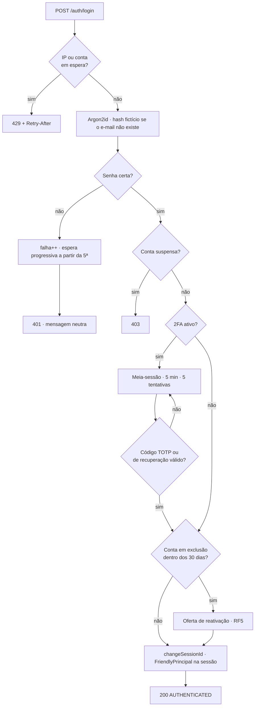

# RF4 · Atividades: login em etapas

```mermaid
flowchart TD
    A[POST /auth/login] --> T{IP ou conta<br/>em espera?}
    T -- sim --> E429[429 + Retry-After]
    T -- não --> H[Argon2id · hash fictício se o e-mail não existe]
    H --> OK{Senha certa?}
    OK -- não --> F[falha++ · espera progressiva a partir da 5ª] --> E401[401 · mensagem neutra]
    OK -- sim --> SU{Conta suspensa?}
    SU -- sim --> E403[403]
    SU -- não --> MFA{2FA ativo?}
    MFA -- sim --> PEND[Meia-sessão · 5 min · 5 tentativas] --> C{Código TOTP ou<br/>de recuperação válido?}
    C -- não --> PEND
    C -- sim --> DEL
    MFA -- não --> DEL{Conta em exclusão<br/>dentro dos 30 dias?}
    DEL -- sim --> RE[Oferta de reativação · RF5]
    DEL -- não --> S[changeSessionId · FriendlyPrincipal na sessão]
    RE --> S
    S --> AUT[200 AUTHENTICATED]
```
