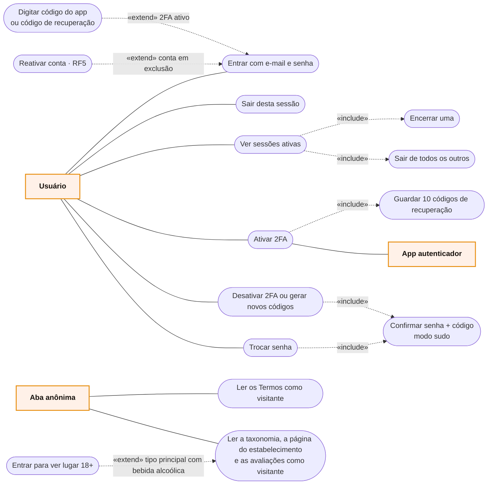

# RF4 · Casos de uso

```mermaid
flowchart LR
    U["Usuário"]:::actor
    A["Aba anônima"]:::actor

    L(["Entrar com e-mail e senha"])
    M(["Digitar código do app<br/>ou código de recuperação"])
    R(["Reativar conta · RF5"])
    O(["Sair desta sessão"])
    S(["Ver sessões ativas"])
    S1(["Encerrar uma"])
    S2(["Sair de todos os outros"])
    F(["Ativar 2FA"])
    F2(["Guardar 10 códigos de recuperação"])
    D(["Desativar 2FA ou gerar novos códigos"])
    SU(["Confirmar senha + código<br/>modo sudo"])
    P(["Trocar senha"])
    X(["Ler os Termos como visitante"])
    XT(["Ler a taxonomia, a página do estabelecimento<br/>e as avaliações como visitante"])
    X18(["Entrar para ver lugar 18+"])

    APP["App autenticador"]:::actor

    U --- L & O & S & F & D & P
    A --- X & XT
    X18 -. «extend» tipo principal com bebida alcoólica .-> XT
    M -. «extend» 2FA ativo .-> L
    R -. «extend» conta em exclusão .-> L
    S -. «include» .-> S1
    S -. «include» .-> S2
    F -. «include» .-> F2
    D -. «include» .-> SU
    P -. «include» .-> SU
    F --- APP

    classDef actor fill:#FFF1E8,stroke:#E88F12,stroke-width:2px,color:#17120D,font-weight:bold
```
