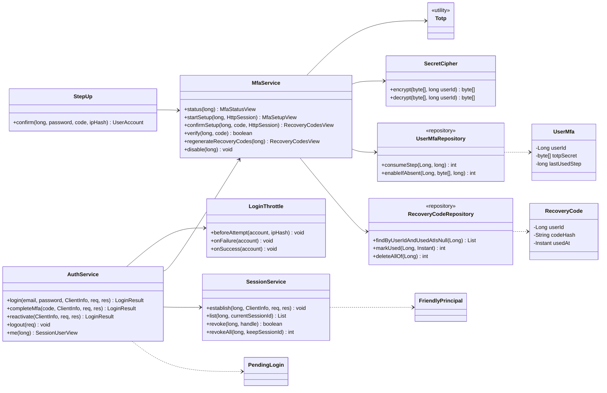

# RF4 · Classes

```mermaid
classDiagram
    direction LR
    class AuthService {
        +login(email, password, ClientInfo, req, res) LoginResult
        +completeMfa(code, ClientInfo, req, res) LoginResult
        +reactivate(ClientInfo, req, res) LoginResult
        +logout(req) void
        +me(long) SessionUserView
    }
    class MfaService {
        +status(long) MfaStatusView
        +startSetup(long, HttpSession) MfaSetupView
        +confirmSetup(long, code, HttpSession) RecoveryCodesView
        +verify(long, code) boolean
        +regenerateRecoveryCodes(long) RecoveryCodesView
        +disable(long) void
    }
    class StepUp {
        +confirm(long, password, code, ipHash) UserAccount
    }
    class SessionService {
        +establish(long, ClientInfo, req, res) void
        +list(long, currentSessionId) List
        +revoke(long, handle) boolean
        +revokeAll(long, keepSessionId) int
    }
    class LoginThrottle {
        +beforeAttempt(account, ipHash) void
        +onFailure(account) void
        +onSuccess(account) void
    }
    class Totp {
        <<utility>>
    }
    class SecretCipher {
        +encrypt(byte[], long userId) byte[]
        +decrypt(byte[], long userId) byte[]
    }
    class PendingLogin
    class FriendlyPrincipal
    class UserMfa {
        -Long userId
        -byte[] totpSecret
        -long lastUsedStep
    }
    class RecoveryCode {
        -Long userId
        -String codeHash
        -Instant usedAt
    }
    class UserMfaRepository {
        <<repository>>
        +consumeStep(Long, long) int
        +enableIfAbsent(Long, byte[], long) int
    }
    class RecoveryCodeRepository {
        <<repository>>
        +findByUserIdAndUsedAtIsNull(Long) List
        +markUsed(Long, Instant) int
        +deleteAllOf(Long) int
    }
    AuthService --> LoginThrottle
    AuthService --> MfaService
    AuthService --> SessionService
    AuthService ..> PendingLogin
    SessionService ..> FriendlyPrincipal
    MfaService --> Totp
    MfaService --> SecretCipher
    MfaService --> UserMfaRepository
    MfaService --> RecoveryCodeRepository
    UserMfaRepository ..> UserMfa
    RecoveryCodeRepository ..> RecoveryCode
    StepUp --> MfaService
```
