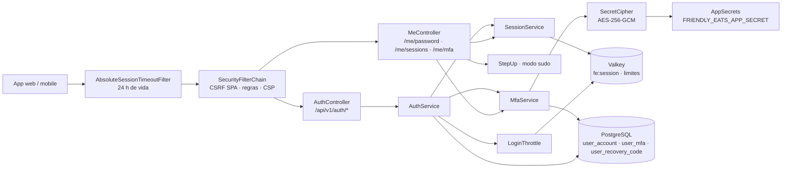

# RF4 · Componentes

```mermaid
flowchart LR
    APP["App web / mobile"] --> F1["AbsoluteSessionTimeoutFilter<br/>24 h de vida"]
    F1 --> SEC["SecurityFilterChain<br/>CSRF SPA · regras · CSP"]
    SEC --> AC["AuthController<br/>/api/v1/auth/*"]
    SEC --> MC["MeController<br/>/me/password · /me/sessions · /me/mfa"]
    AC --> AS["AuthService"]
    MC --> MS["MfaService"]
    MC --> SU["StepUp · modo sudo"]
    MC --> SS["SessionService"]
    AS --> LT["LoginThrottle"]
    AS --> MS
    AS --> SS
    MS --> SC["SecretCipher<br/>AES-256-GCM"]
    SC --> AK["AppSecrets<br/>FRIENDLY_EATS_APP_SECRET"]
    LT & SS --> VK[("Valkey<br/>fe:session · limites")]
    AS & MS --> PG[("PostgreSQL<br/>user_account · user_mfa · user_recovery_code")]
```
