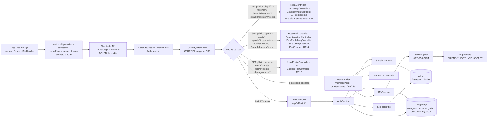

# RF4 · Componentes

```mermaid
flowchart LR
    WEB["App web Next.js<br/>/entrar · /conta · SiteHeader"] --> NX["next.config rewrites e cabeçalhos<br/>nosniff · no-referrer · frame-ancestors none"] --> APP["Cliente da API<br/>same-origin · X-XSRF-TOKEN do cookie"] --> F1["AbsoluteSessionTimeoutFilter<br/>24 h de vida"]
    F1 --> SEC["SecurityFilterChain<br/>CSRF SPA · regras · CSP"]
    SEC --> RULES{"Regras de rota"}
    RULES -- "GET público: /legal/** · /taxonomy ·<br/>/establishments/* · /establishments/*/reviews" --> PUB["LegalController · TaxonomyController ·<br/>EstablishmentController<br/>18+ decidido no EstablishmentService · RF6"]
    RULES -- "GET público: /posts · /posts/* · /posts/*/comments ·<br/>/posts/trending · /establishments/*/posts" --> PP["PostFeedController · PostInteractionController ·<br/>PostPublishingController<br/>18+ e perfil privado no PostReader · RF14"]
    RULES -- "GET público: /users · /users/*/profile ·<br/>/users/*/posts · /backgrounds/**" --> UP["UserProfileController · RF15<br/>BackgroundController · RF16"]
    RULES -- "/auth/** · /error" --> AC["AuthController<br/>/api/v1/auth/*"]
    RULES -- "o resto exige sessão" --> MC["MeController<br/>/me/password · /me/sessions · /me/mfa"]
    AC --> AS["AuthService"]
    MC --> MS["MfaService"]
    MC --> SU["StepUp · modo sudo"]
    MC --> SS["SessionService"]
    AS --> LT["LoginThrottle"]
    AS --> MS
    AS --> SS
    MS --> SC["SecretCipher<br/>AES-256-GCM"]
    SC --> AK["AppSecrets<br/>FRIENDLY_EATS_APP_SECRET"]
    LT & SS --> VK[("Valkey<br/>fe:session · limites")]
    AS & MS --> PG[("PostgreSQL<br/>user_account · user_mfa · user_recovery_code")]
```
