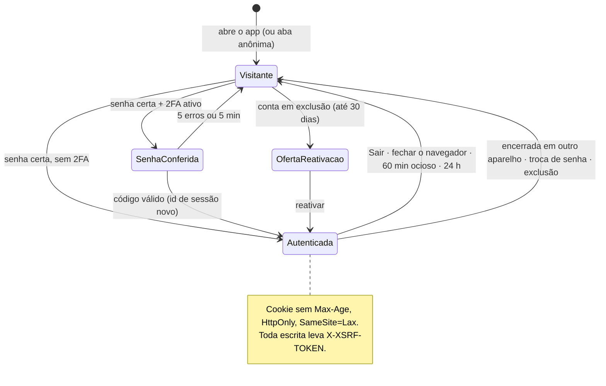
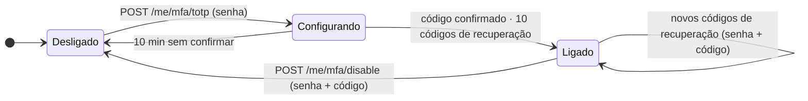

# RF4 · Estados da sessão no navegador

```mermaid
stateDiagram-v2
    [*] --> Visitante : abre o app (ou aba anônima)
    Visitante --> SenhaConferida : senha certa + 2FA ativo
    Visitante --> Autenticada : senha certa, sem 2FA
    Visitante --> OfertaReativacao : conta em exclusão (até 30 dias)
    SenhaConferida --> Autenticada : código válido (id de sessão novo)
    SenhaConferida --> Visitante : 5 erros ou 5 min
    OfertaReativacao --> Autenticada : reativar
    Autenticada --> Visitante : Sair · fechar o navegador · 60 min ocioso · 24 h
    Autenticada --> Visitante : encerrada em outro aparelho · troca de senha · exclusão
    note right of Autenticada
        Cookie sem Max-Age, HttpOnly, SameSite=Lax.
        Toda escrita leva X-XSRF-TOKEN.
    end note
```

## 2FA da conta

```mermaid
stateDiagram-v2
    direction LR
    [*] --> Desligado
    Desligado --> Configurando : POST /me/mfa/totp (senha)
    Configurando --> Ligado : código confirmado · 10 códigos de recuperação
    Configurando --> Desligado : 10 min sem confirmar
    Ligado --> Ligado : novos códigos de recuperação (senha + código)
    Ligado --> Desligado : POST /me/mfa/disable (senha + código)
```
