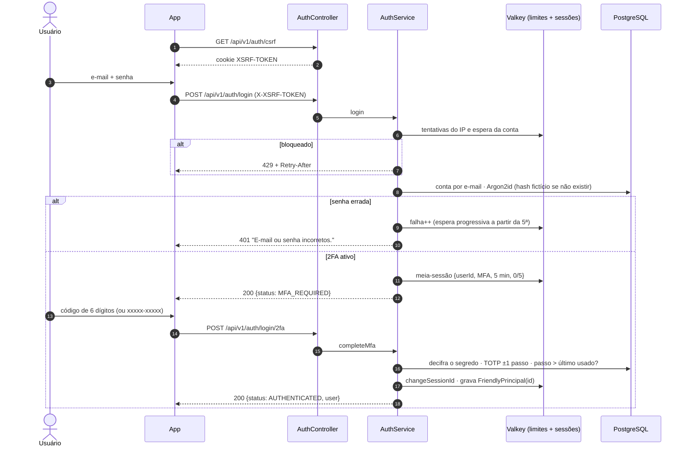
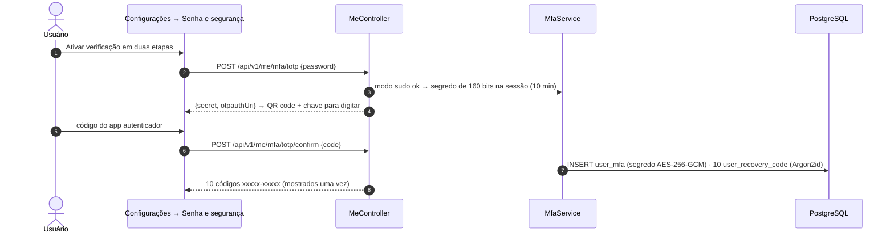

# RF4 · Sequência

## Login com 2FA

```mermaid
sequenceDiagram
    autonumber
    actor U as Usuário
    participant APP as App
    participant API as AuthController
    participant A as AuthService
    participant VK as Valkey (limites + sessões)
    participant DB as PostgreSQL

    APP->>API: GET /api/v1/auth/csrf
    API-->>APP: cookie XSRF-TOKEN
    U->>APP: e-mail + senha
    APP->>API: POST /api/v1/auth/login (X-XSRF-TOKEN)
    API->>A: login
    A->>VK: tentativas do IP e espera da conta
    alt bloqueado
        A-->>APP: 429 + Retry-After
    end
    A->>DB: conta por e-mail · Argon2id (hash fictício se não existir)
    alt senha errada
        A->>VK: falha++ (espera progressiva a partir da 5ª)
        A-->>APP: 401 "E-mail ou senha incorretos."
    else 2FA ativo
        A->>VK: meia-sessão {userId, MFA, 5 min, 0/5}
        A-->>APP: 200 {status: MFA_REQUIRED}
        U->>APP: código de 6 dígitos (ou xxxxx-xxxxx)
        APP->>API: POST /api/v1/auth/login/2fa
        API->>A: completeMfa
        A->>DB: decifra o segredo · TOTP ±1 passo · passo > último usado?
        A->>VK: changeSessionId · grava FriendlyPrincipal(id)
        A-->>APP: 200 {status: AUTHENTICATED, user}
    end
```

## Ativar o 2FA

```mermaid
sequenceDiagram
    autonumber
    actor U as Usuário
    participant APP as Configurações → Senha e segurança
    participant API as MeController
    participant M as MfaService
    participant DB as PostgreSQL

    U->>APP: Ativar verificação em duas etapas
    APP->>API: POST /api/v1/me/mfa/totp {password}
    API->>M: modo sudo ok → segredo de 160 bits na sessão (10 min)
    API-->>APP: {secret, otpauthUri} → QR code + chave para digitar
    U->>APP: código do app autenticador
    APP->>API: POST /api/v1/me/mfa/totp/confirm {code}
    M->>DB: INSERT user_mfa (segredo AES-256-GCM) · 10 user_recovery_code (Argon2id)
    API-->>APP: 10 códigos xxxxx-xxxxx (mostrados uma vez)
```
