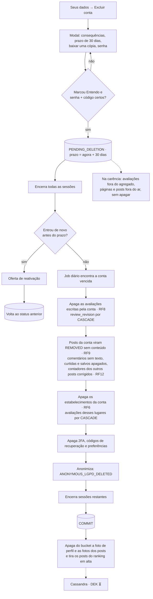

# RF5 · Atividades

```mermaid
flowchart TD
    A[Seus dados → Excluir conta] --> M[Modal: consequências, prazo de 30 dias,<br/>baixar uma cópia, senha]
    M --> C{Marcou Entendo e<br/>senha + código certos?}
    C -- não --> M
    C -- sim --> P[(PENDING_DELETION · prazo = agora + 30 dias)]
    P --> S[Encerra todas as sessões]
    S --> W{Entrou de novo<br/>antes do prazo?}
    W -- sim --> R[Oferta de reativação] --> RA[(Volta ao status anterior)]
    W -- não --> J[Job diário encontra a conta vencida]
    J --> E0[Apaga as avaliações escritas pela conta · RF8<br/>review_revision por CASCADE]
    EE[Apaga os estabelecimentos da conta · RF6<br/>avaliações desses lugares por CASCADE]
    E0 --> PO[Posts da conta viram REMOVED sem conteúdo · RF9<br/>comentários sem texto, curtidas e salvos apagados,<br/>contadores dos outros posts corrigidos · RF12]
    PO --> EE
    EE --> E1[Apaga 2FA, códigos de recuperação e preferências]
    E1 --> E2[Anonimiza: ANONYMOUS_LGPD_DELETED]
    E2 --> E3[Encerra sessões restantes]
    E3 --> CM[(COMMIT)]
    CM --> E4[Apaga do bucket a foto de perfil e as fotos dos posts<br/>e tira os posts do ranking em alta]
    E4 -.-> E5[Cassandra · DEK ⏳]
    P -.-> H[Na carência: avaliações fora do agregado,<br/>páginas e posts fora do ar, sem apagar]
```
