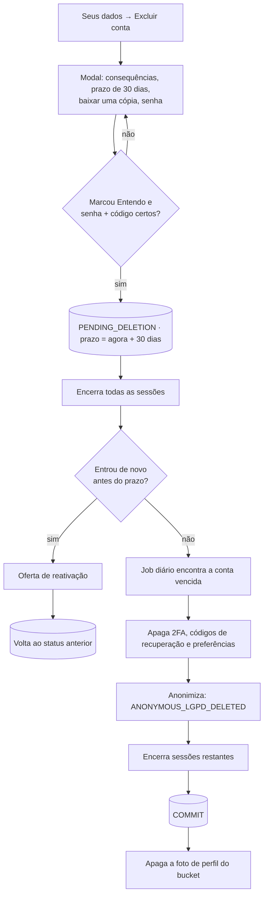

# RF5 · Atividades

```mermaid
flowchart TD
    A[Seus dados → Excluir conta] --> M[Modal: consequências, prazo de 30 dias,<br/>baixar uma cópia, senha]
    M --> C{Marcou Entendo e<br/>senha + código certos?}
    C -- não --> M
    C -- sim --> P[(PENDING_DELETION · prazo = agora + 30 dias)]
    P --> S[Encerra todas as sessões]
    S --> W{Entrou de novo<br/>antes do prazo?}
    W -- sim --> R[Oferta de reativação] --> RA[(Volta ao status anterior)]
    W -- não --> J[Job diário encontra a conta vencida]
    J --> E1[Apaga 2FA, códigos de recuperação e preferências]
    E1 --> E2[Anonimiza: ANONYMOUS_LGPD_DELETED]
    E2 --> E3[Encerra sessões restantes]
    E3 --> CM[(COMMIT)]
    CM --> E4[Apaga a foto de perfil do bucket]
```
