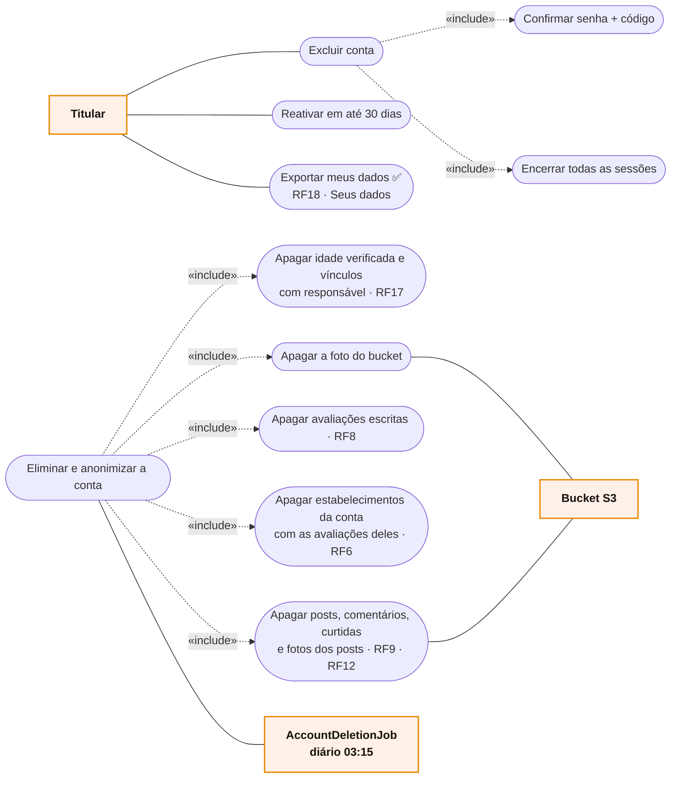

# RF5 · Casos de uso

```mermaid
flowchart LR
    T["Titular"]:::actor

    EXC(["Excluir conta"])
    SUDO(["Confirmar senha + código"])
    FIM(["Encerrar todas as sessões"])
    REAT(["Reativar em até 30 dias"])
    EXP(["Exportar meus dados ✅<br/>RF18 · Seus dados"])
    R17(["Apagar idade verificada e vínculos<br/>com responsável · RF17"])
    ELIM(["Eliminar e anonimizar a conta"])
    FOTO(["Apagar a foto do bucket"])
    AVAL(["Apagar avaliações escritas · RF8"])
    ESTB(["Apagar estabelecimentos da conta<br/>com as avaliações deles · RF6"])
    APAG(["Apagar posts, comentários, curtidas<br/>e fotos dos posts · RF9 · RF12"])

    JOB["AccountDeletionJob<br/>diário 03:15"]:::actor
    S3["Bucket S3"]:::actor

    T --- EXC & REAT & EXP
    EXC -. «include» .-> SUDO
    EXC -. «include» .-> FIM
    ELIM -. «include» .-> FOTO
    ELIM -. «include» .-> AVAL
    ELIM -. «include» .-> ESTB
    ELIM -. «include» .-> APAG
    ELIM -. «include» .-> R17
    ELIM --- JOB
    FOTO --- S3
    APAG --- S3

    classDef actor fill:#FFF1E8,stroke:#E88F12,stroke-width:2px,color:#17120D,font-weight:bold
    classDef planned stroke-dasharray:5 4
```
