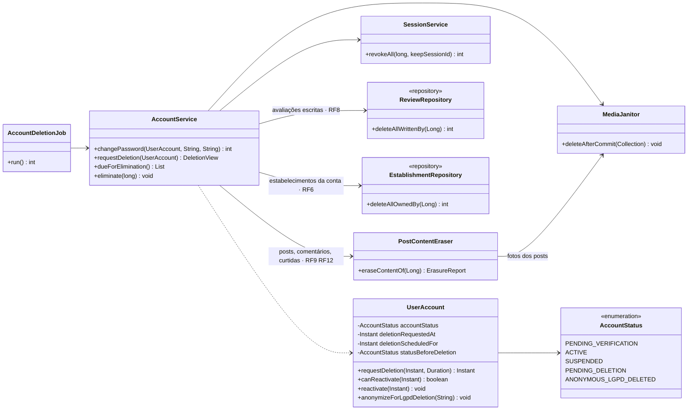

# RF5 · Classes

```mermaid
classDiagram
    direction LR
    class UserAccount {
        -AccountStatus accountStatus
        -Instant deletionRequestedAt
        -Instant deletionScheduledFor
        -AccountStatus statusBeforeDeletion
        +requestDeletion(Instant, Duration) Instant
        +canReactivate(Instant) boolean
        +reactivate(Instant) void
        +anonymizeForLgpdDeletion(String) void
    }
    class AccountStatus {
        <<enumeration>>
        PENDING_VERIFICATION
        ACTIVE
        SUSPENDED
        PENDING_DELETION
        ANONYMOUS_LGPD_DELETED
    }
    class AccountService {
        +changePassword(UserAccount, String, String) int
        +requestDeletion(UserAccount) DeletionView
        +dueForElimination() List
        +eliminate(long) void
    }
    class AccountDeletionJob {
        +run() int
    }
    class MediaJanitor {
        +deleteAfterCommit(Collection) void
    }
    class SessionService {
        +revokeAll(long, keepSessionId) int
    }
    class ReviewRepository {
        <<repository>>
        +deleteAllWrittenBy(Long) int
    }
    class EstablishmentRepository {
        <<repository>>
        +deleteAllOwnedBy(Long) int
    }
    class PostContentEraser {
        +eraseContentOf(Long) ErasureReport
    }
    AccountDeletionJob --> AccountService
    AccountService --> MediaJanitor
    AccountService --> SessionService
    AccountService --> ReviewRepository : avaliações escritas · RF8
    AccountService --> EstablishmentRepository : estabelecimentos da conta · RF6
    AccountService --> PostContentEraser : posts, comentários, curtidas · RF9 RF12
    PostContentEraser --> MediaJanitor : fotos dos posts
    AccountService ..> UserAccount
    UserAccount --> AccountStatus
```
