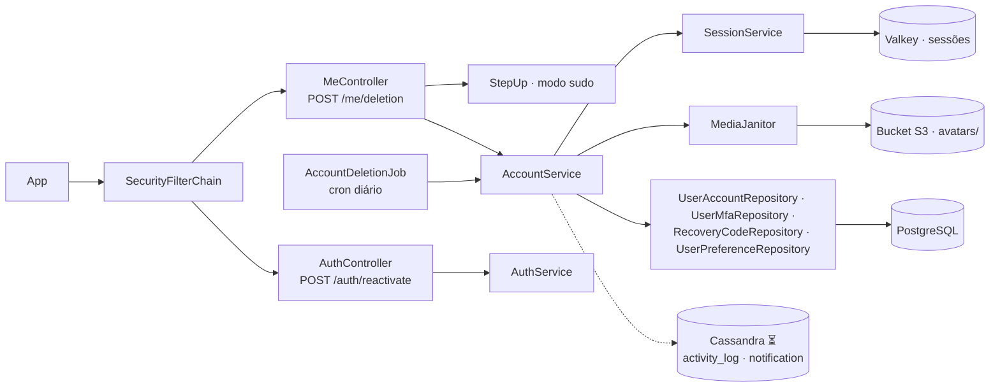

# RF5 · Componentes

```mermaid
flowchart LR
    APP["App"] --> SEC["SecurityFilterChain"]
    SEC --> MC["MeController<br/>POST /me/deletion"]
    SEC --> AC["AuthController<br/>POST /auth/reactivate"]
    MC --> SU["StepUp · modo sudo"]
    MC --> AS["AccountService"]
    AC --> AU["AuthService"]
    JOB["AccountDeletionJob<br/>cron diário"] --> AS
    AS --> SS["SessionService"]
    AS --> MJ["MediaJanitor"]
    AS --> REPO["UserAccountRepository · UserMfaRepository ·<br/>RecoveryCodeRepository · UserPreferenceRepository"]
    REPO --> PG[("PostgreSQL")]
    SS --> VK[("Valkey · sessões")]
    MJ --> S3[("Bucket S3 · avatars/")]
    AS -.-> CS[("Cassandra ⏳<br/>activity_log · notification")]
```
