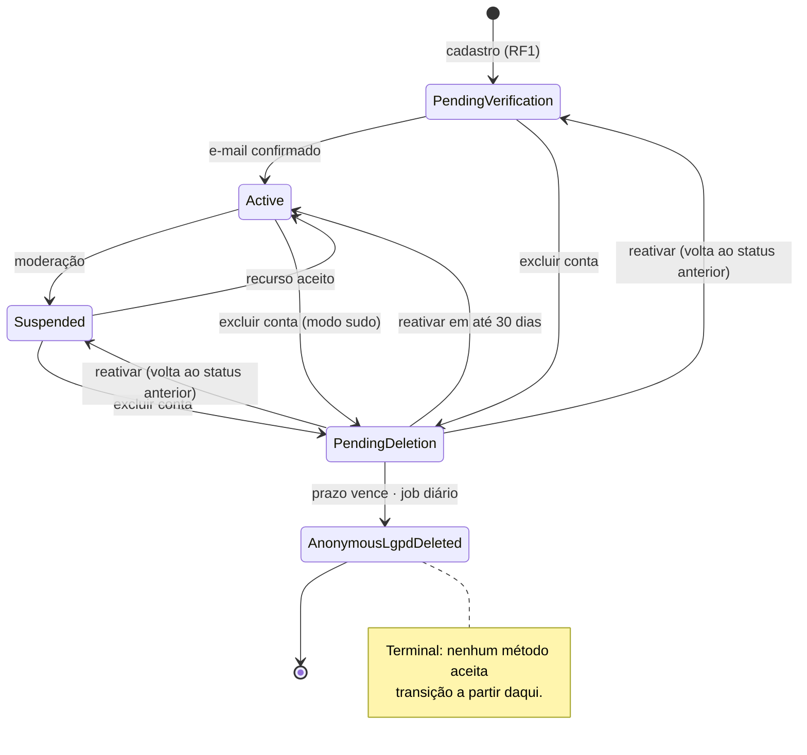
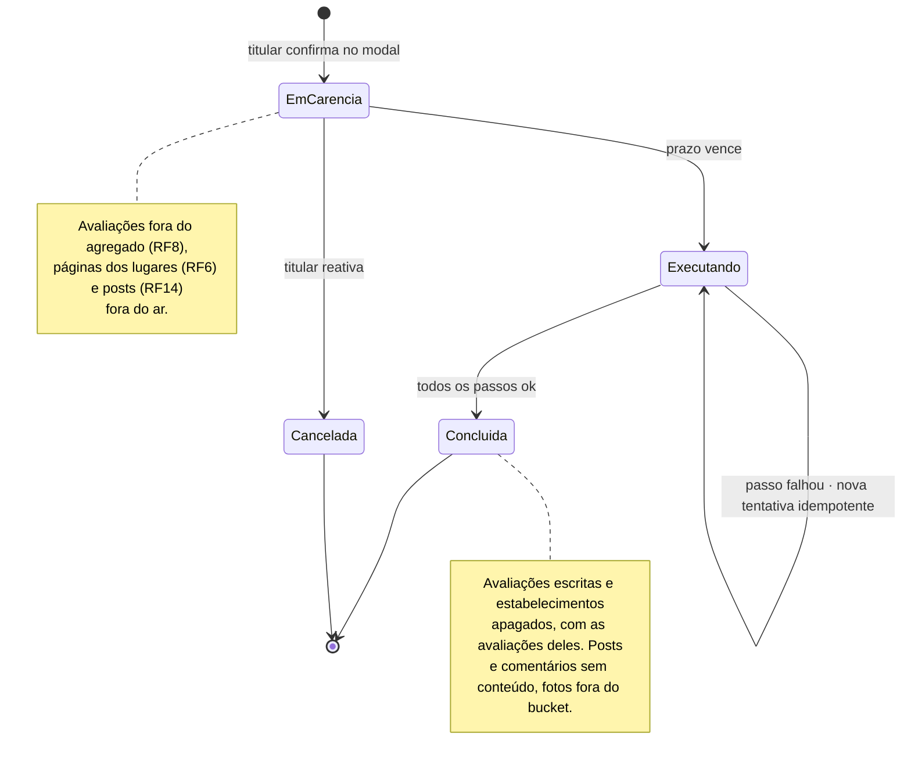

# RF5 · Estados

## Ciclo de vida da conta

```mermaid
stateDiagram-v2
    [*] --> PendingVerification : cadastro (RF1)
    PendingVerification --> Active : e-mail confirmado
    Active --> Suspended : moderação
    Suspended --> Active : recurso aceito
    Active --> PendingDeletion : excluir conta (modo sudo)
    PendingVerification --> PendingDeletion : excluir conta
    Suspended --> PendingDeletion : excluir conta
    PendingDeletion --> Active : reativar em até 30 dias
    PendingDeletion --> PendingVerification : reativar (volta ao status anterior)
    PendingDeletion --> Suspended : reativar (volta ao status anterior)
    PendingDeletion --> AnonymousLgpdDeleted : prazo vence · job diário
    AnonymousLgpdDeleted --> [*]
    note right of AnonymousLgpdDeleted
        Terminal: nenhum método aceita
        transição a partir daqui.
    end note
```

## Saga de eliminação

```mermaid
stateDiagram-v2
    [*] --> EmCarencia : titular confirma no modal
    EmCarencia --> Cancelada : titular reativa
    EmCarencia --> Executando : prazo vence
    Executando --> Executando : passo falhou · nova tentativa idempotente
    Executando --> Concluida : todos os passos ok
    Concluida --> [*]
    Cancelada --> [*]
    note right of EmCarencia
        Avaliações fora do agregado (RF8),
        páginas dos lugares (RF6) e posts (RF14)
        fora do ar.
    end note
    note right of Concluida
        Avaliações escritas e estabelecimentos
        apagados, com as avaliações deles. Posts
        e comentários sem conteúdo, fotos fora do bucket.
    end note
```
