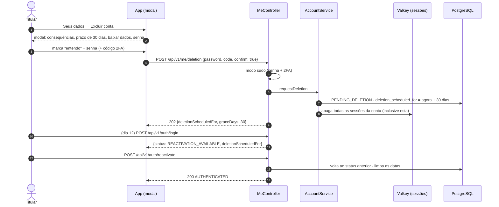
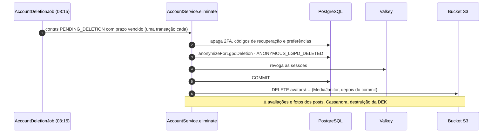

# RF5 · Sequência

## Excluir e reativar

```mermaid
sequenceDiagram
    autonumber
    actor T as Titular
    participant APP as App (modal)
    participant API as MeController
    participant AC as AccountService
    participant VK as Valkey (sessões)
    participant DB as PostgreSQL

    T->>APP: Seus dados → Excluir conta
    APP-->>T: modal: consequências, prazo de 30 dias, baixar dados, senha
    T->>APP: marca "entendo" + senha (+ código 2FA)
    APP->>API: POST /api/v1/me/deletion {password, code, confirm: true}
    API->>API: modo sudo (senha + 2FA)
    API->>AC: requestDeletion
    AC->>DB: PENDING_DELETION · deletion_scheduled_for = agora + 30 dias
    AC->>VK: apaga todas as sessões da conta (inclusive esta)
    API-->>APP: 202 {deletionScheduledFor, graceDays: 30}
    T->>API: (dia 12) POST /api/v1/auth/login
    API-->>APP: {status: REACTIVATION_AVAILABLE, deletionScheduledFor}
    T->>API: POST /api/v1/auth/reactivate
    API->>DB: volta ao status anterior · limpa as datas
    API-->>APP: 200 AUTHENTICATED
```

## Eliminação depois do prazo

```mermaid
sequenceDiagram
    autonumber
    participant JOB as AccountDeletionJob (03:15)
    participant AC as AccountService.eliminate
    participant DB as PostgreSQL
    participant VK as Valkey
    participant S3 as Bucket S3

    JOB->>AC: contas PENDING_DELETION com prazo vencido (uma transação cada)
    AC->>DB: apaga 2FA, códigos de recuperação e preferências
    AC->>DB: anonymizeForLgpdDeletion · ANONYMOUS_LGPD_DELETED
    AC->>VK: revoga as sessões
    AC->>DB: COMMIT
    AC->>S3: DELETE avatars/… (MediaJanitor, depois do commit)
    Note over AC,S3: ⏳ avaliações e fotos dos posts, Cassandra, destruição da DEK
```
