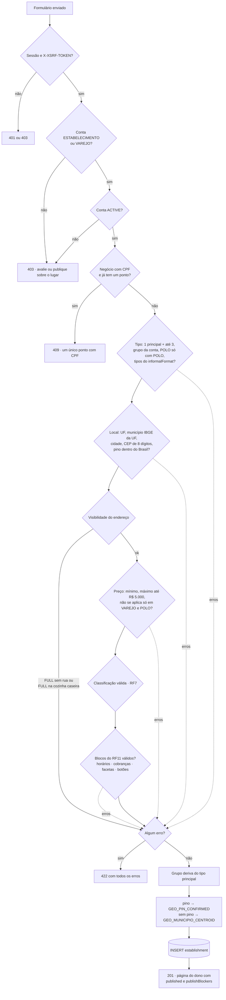
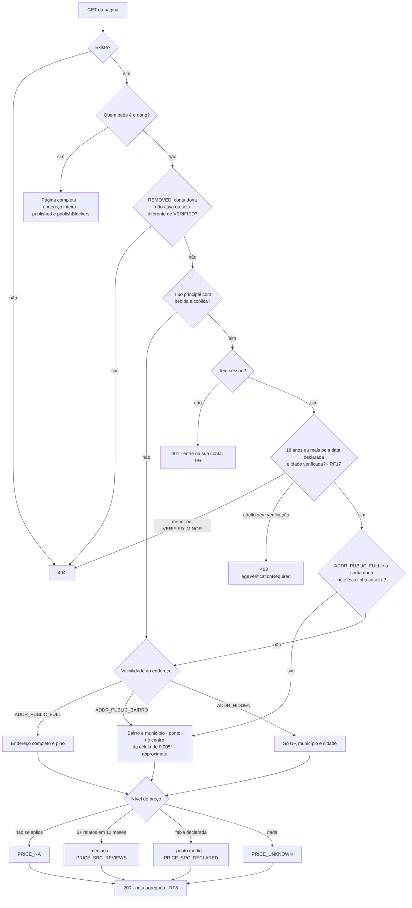

# RF6 · Atividades

## Cadastrar (`POST /api/v1/establishments`)

```mermaid
flowchart TD
    A[Formulário enviado] --> S{Sessão e X-XSRF-TOKEN?}
    S -- não --> E401[401 ou 403]
    S -- sim --> T{Conta ESTABELECIMENTO<br/>ou VAREJO?}
    T -- não --> E403[403 · avalie ou publique sobre o lugar]
    T -- sim --> AT{Conta ACTIVE?}
    AT -- não --> E403
    AT -- sim --> CPF{Negócio com CPF<br/>e já tem um ponto?}
    CPF -- sim --> E409[409 · um único ponto com CPF]
    CPF -- não --> TP{Tipo: 1 principal + até 3,<br/>grupo da conta, POLO só com POLO,<br/>tipos do informalFormat?}
    TP --> LO{Local: UF, município IBGE da UF,<br/>cidade, CEP de 8 dígitos,<br/>pino dentro do Brasil?}
    LO --> VI{Visibilidade do endereço}
    VI -- "FULL sem rua ou<br/>FULL na cozinha caseira" --> ERR
    VI -- ok --> PR{Preço: mínimo, máximo até R$ 5.000,<br/>não se aplica só em VAREJO e POLO?}
    PR --> CL{Classificação válida · RF7}
    CL --> RF11{Blocos do RF11 válidos?<br/>horários · cobranças · facetas · botões}
    RF11 -. erros .-> ERR
    RF11 --> ERR{Algum erro?}
    TP -. erros .-> ERR
    LO -. erros .-> ERR
    PR -. erros .-> ERR
    ERR -- sim --> E422[422 com todos os erros]
    ERR -- não --> G[Grupo deriva do tipo principal]
    G --> GP[pino → GEO_PIN_CONFIRMED<br/>sem pino → GEO_MUNICIPIO_CENTROID]
    GP --> DB[(INSERT establishment)]
    DB --> R[201 · página do dono com<br/>published e publishBlockers]
```

## Ver a página (`GET /api/v1/establishments/{id}`)

```mermaid
flowchart TD
    G[GET da página] --> X{Existe?}
    X -- não --> N404[404]
    X -- sim --> O{Quem pede é o dono?}
    O -- sim --> FULL[Página completa · endereço inteiro ·<br/>published e publishBlockers]
    O -- não --> B{REMOVED, conta dona<br/>não ativa ou selo<br/>diferente de VERIFIED?}
    B -- sim --> N404
    B -- não --> AL{Tipo principal com<br/>bebida alcoólica?}
    AL -- não --> V
    AL -- sim --> LG{Tem sessão?}
    LG -- não --> N401[401 · entre na sua conta, 18+]
    LG -- sim --> AD{18 anos ou mais pela data declarada<br/>e idade verificada? · RF17}
    AD -- "menor ou VERIFIED_MINOR" --> N404
    AD -- "adulto sem verificação" --> N403[403 · ageVerificationRequired]
    AD -- "sim" --> CC{ADDR_PUBLIC_FULL e a conta dona<br/>hoje é cozinha caseira?}
    CC -- sim --> P2
    CC -- não --> V{Visibilidade do endereço}
    V -- ADDR_PUBLIC_FULL --> P1[Endereço completo e pino]
    V -- ADDR_PUBLIC_BAIRRO --> P2[Bairro e município · ponto no centro<br/>da célula de 0,005° · approximate]
    V -- ADDR_HIDDEN --> P3[Só UF, município e cidade]
    P1 & P2 & P3 --> PRICE{Nível de preço}
    PRICE -- não se aplica --> NA[PRICE_NA]
    PRICE -- "5+ relatos em 12 meses" --> MED[mediana · PRICE_SRC_REVIEWS]
    PRICE -- faixa declarada --> DEC[ponto médio · PRICE_SRC_DECLARED]
    PRICE -- nada --> UNK[PRICE_UNKNOWN]
    NA & MED & DEC & UNK --> OK[200 · nota agregada · RF8]
```
