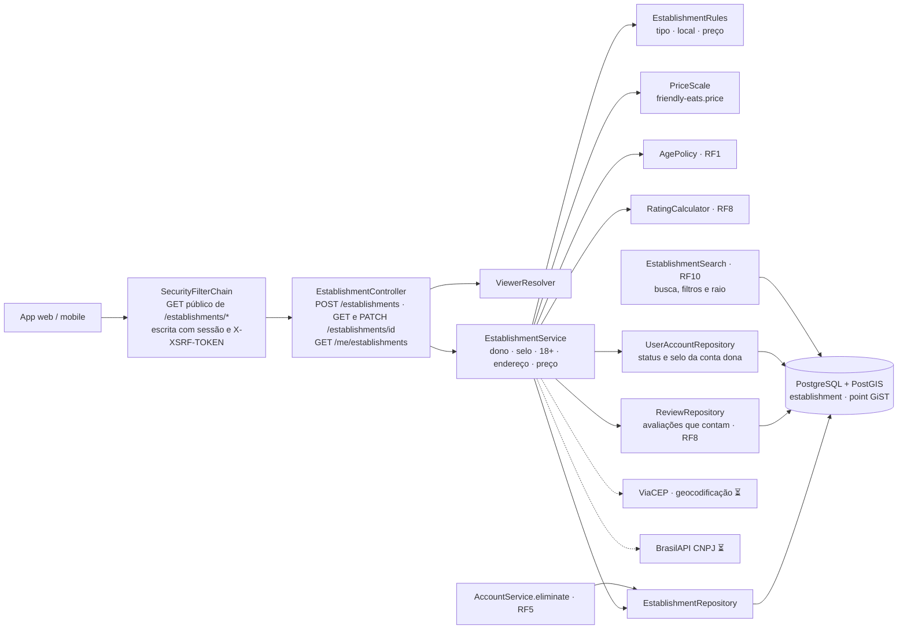

# RF6 · Componentes

```mermaid
flowchart LR
    APP["App web / mobile"] --> SEC["SecurityFilterChain<br/>GET público de /establishments/*<br/>escrita com sessão e X-XSRF-TOKEN"]
    SEC --> EC["EstablishmentController<br/>POST /establishments · GET e PATCH /establishments/id<br/>GET /me/establishments"]
    EC --> VR["ViewerResolver"]
    EC --> ES["EstablishmentService<br/>dono · selo · 18+ · endereço · preço"]
    ES --> RU["EstablishmentRules<br/>tipo · local · preço"]
    ES --> PS["PriceScale<br/>friendly-eats.price"]
    ES --> AP["AgePolicy · RF1"]
    ES --> RC["RatingCalculator · RF8"]
    ES --> ER["EstablishmentRepository"]
    ES --> RR["ReviewRepository<br/>avaliações que contam · RF8"]
    ES --> UR["UserAccountRepository<br/>status e selo da conta dona"]
    ER & RR & UR --> PG[("PostgreSQL + PostGIS<br/>establishment · point GiST")]
    AS["AccountService.eliminate · RF5"] --> ER
    ES -.-> GEO["ViaCEP · geocodificação ⏳"]
    ES -.-> BR["BrasilAPI CNPJ ⏳"]
    SR["EstablishmentSearch · RF10<br/>busca, filtros e raio"] --> PG
```
