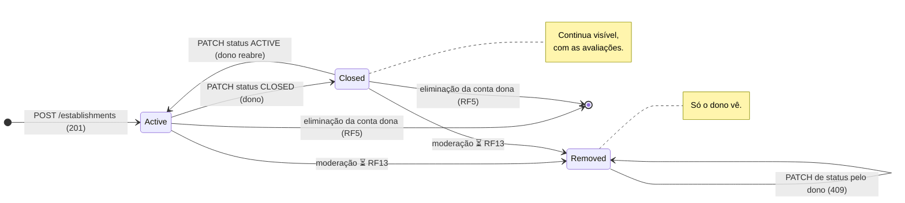
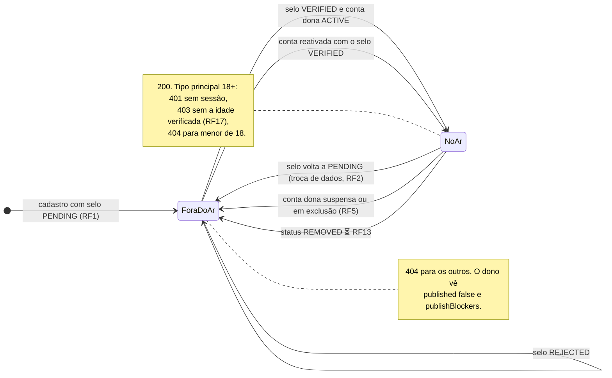

# RF6 · Estados

## Situação do estabelecimento (`establishment.status`)

```mermaid
stateDiagram-v2
    direction LR
    [*] --> Active : POST /establishments (201)
    Active --> Closed : PATCH status CLOSED (dono)
    Closed --> Active : PATCH status ACTIVE (dono reabre)
    Active --> Removed : moderação ⏳ RF13
    Closed --> Removed : moderação ⏳ RF13
    Removed --> Removed : PATCH de status pelo dono (409)
    Active --> [*] : eliminação da conta dona (RF5)
    Closed --> [*] : eliminação da conta dona (RF5)
    note right of Closed
        Continua visível,
        com as avaliações.
    end note
    note right of Removed
        Só o dono vê.
    end note
```

## Página para quem não é o dono

```mermaid
stateDiagram-v2
    direction LR
    [*] --> ForaDoAr : cadastro com selo PENDING (RF1)
    ForaDoAr --> NoAr : selo VERIFIED e conta dona ACTIVE
    NoAr --> ForaDoAr : selo volta a PENDING (troca de dados, RF2)
    NoAr --> ForaDoAr : conta dona suspensa ou em exclusão (RF5)
    ForaDoAr --> NoAr : conta reativada com o selo VERIFIED
    NoAr --> ForaDoAr : status REMOVED ⏳ RF13
    ForaDoAr --> ForaDoAr : selo REJECTED
    note right of ForaDoAr
        404 para os outros. O dono vê
        published false e publishBlockers.
    end note
    note left of NoAr
        200. Tipo principal 18+: 401 sem sessão,
        403 sem a idade verificada (RF17),
        404 para menor de 18.
    end note
```
