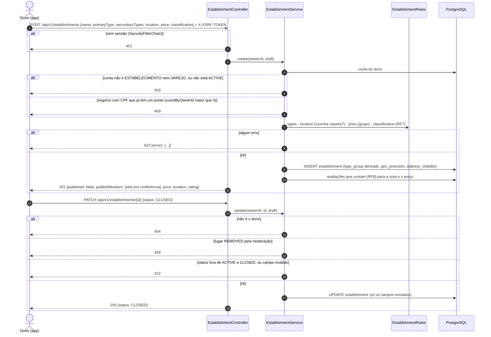
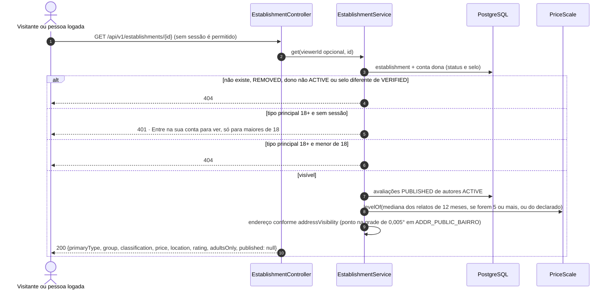

# RF6 · Sequência

## Cadastrar e editar

```mermaid
sequenceDiagram
    autonumber
    actor D as Dono (app)
    participant API as EstablishmentController
    participant S as EstablishmentService
    participant R as EstablishmentRules
    participant DB as PostgreSQL

    D->>API: POST /api/v1/establishments {name, primaryType, secondaryTypes, location, price, classification} + X-XSRF-TOKEN
    alt sem sessão (SecurityFilterChain)
        API-->>D: 401
    end
    API->>S: create(viewerId, draft)
    S->>DB: conta do dono
    alt conta não é ESTABELECIMENTO nem VAREJO, ou não está ACTIVE
        S-->>D: 403
    else negócio com CPF que já tem um ponto (countByOwnerId maior que 0)
        S-->>D: 409
    end
    S->>R: types · location (cozinha caseira?) · price (grupo) · classification (RF7)
    alt algum erro
        S-->>D: 422 {errors: [...]}
    else ok
        S->>DB: INSERT establishment (type_group derivado, geo_precision, address_visibility)
        S->>DB: avaliações que contam (RF8) para a nota e o preço
        API-->>D: 201 {published: false, publishBlockers: [selo em conferência], price, location, rating}
    end
    D->>API: PATCH /api/v1/establishments/{id} {status: CLOSED}
    API->>S: update(viewerId, id, draft)
    alt não é o dono
        S-->>D: 404
    else lugar REMOVED pela moderação
        S-->>D: 409
    else status fora de ACTIVE e CLOSED, ou campo inválido
        S-->>D: 422
    else ok
        S->>DB: UPDATE establishment (só os campos enviados)
        API-->>D: 200 {status: CLOSED}
    end
```

## Ver a página

```mermaid
sequenceDiagram
    autonumber
    actor V as Visitante ou pessoa logada
    participant API as EstablishmentController
    participant S as EstablishmentService
    participant DB as PostgreSQL
    participant PS as PriceScale

    V->>API: GET /api/v1/establishments/{id} (sem sessão é permitido)
    API->>S: get(viewerId opcional, id)
    S->>DB: establishment + conta dona (status e selo)
    alt não existe, REMOVED, dono não ACTIVE ou selo diferente de VERIFIED
        S-->>V: 404
    else tipo principal 18+ e sem sessão
        S-->>V: 401 · Entre na sua conta para ver, só para maiores de 18
    else tipo principal 18+ e menor de 18
        S-->>V: 404
    else visível
        S->>DB: avaliações PUBLISHED de autores ACTIVE
        S->>PS: levelOf(mediana dos relatos de 12 meses, se forem 5 ou mais, ou do declarado)
        S->>S: endereço conforme addressVisibility (ponto na grade de 0,005° em ADDR_PUBLIC_BAIRRO)
        API-->>V: 200 {primaryType, group, classification, price, location, rating, adultsOnly, published: null}
    end
```

Para o dono, a mesma chamada sempre devolve `200`, com o endereço completo, `published` e `publishBlockers`.
