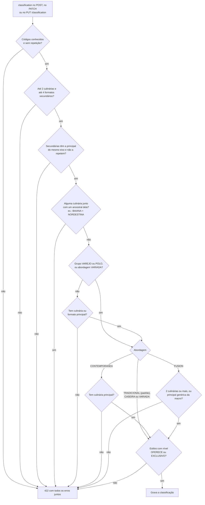
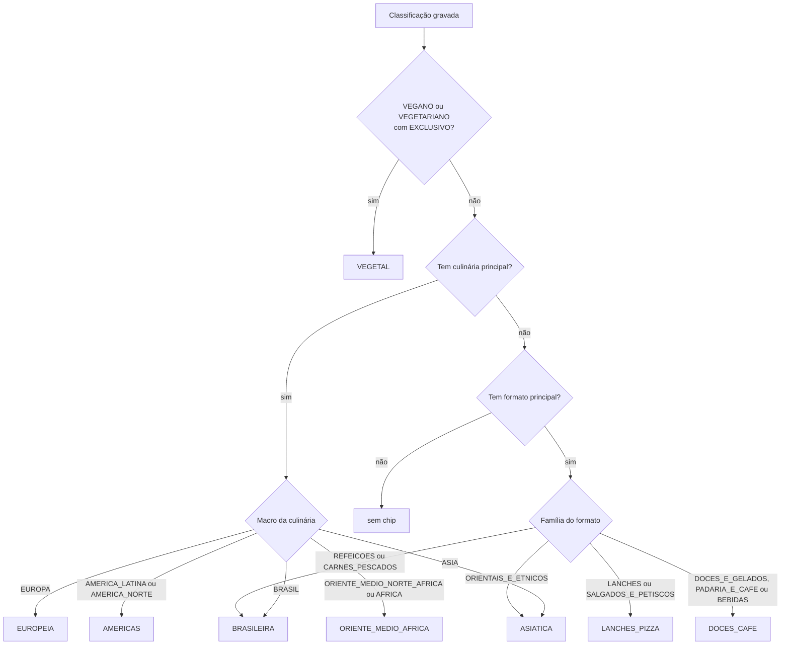

# RF7 · Atividades

## Validar a classificação (`EstablishmentRules.classification`)

```mermaid
flowchart TD
    A[classification no POST, no PATCH<br/>ou no PUT /classification] --> C{Códigos conhecidos<br/>e sem repetição?}
    C -- não --> ERR
    C -- sim --> N{Até 2 culinárias e<br/>até 4 formatos secundários?}
    N -- não --> ERR
    N -- sim --> P{Secundárias têm a principal<br/>do mesmo eixo e não a repetem?}
    P -- não --> ERR
    P -- sim --> AN{Alguma culinária junto<br/>com um ancestral dela?<br/>ex.: BAIANA + NORDESTINA}
    AN -- sim --> ERR
    AN -- não --> OB{Grupo VAREJO ou POLO,<br/>ou abordagem VARIADA?}
    OB -- sim --> AB
    OB -- não --> CF{Tem culinária ou<br/>formato principal?}
    CF -- não --> ERR
    CF -- sim --> AB{Abordagem}
    AB -- "TRADICIONAL (padrão),<br/>CASEIRA ou VARIADA" --> ES
    AB -- CONTEMPORANEA --> CO{Tem culinária principal?}
    CO -- não --> ERR
    CO -- sim --> ES
    AB -- FUSION --> FU{2 culinárias ou mais, ou<br/>principal genérica da macro?}
    FU -- não --> ERR
    FU -- sim --> ES{Estilos com nível<br/>OFERECE ou EXCLUSIVO?}
    ES -- não --> ERR
    ES -- sim --> OK[Grava a classificação]
    ERR[422 com todos os erros juntos]
```

## Derivar o chip (`CuisineChip.of`)

```mermaid
flowchart TD
    S[Classificação gravada] --> V{VEGANO ou VEGETARIANO<br/>com EXCLUSIVO?}
    V -- sim --> VEG[VEGETAL]
    V -- não --> CU{Tem culinária principal?}
    CU -- sim --> M{Macro da culinária}
    M -- BRASIL --> BR[BRASILEIRA]
    M -- EUROPA --> EU[EUROPEIA]
    M -- ASIA --> AS[ASIATICA]
    M -- "AMERICA_LATINA ou AMERICA_NORTE" --> AM[AMERICAS]
    M -- "ORIENTE_MEDIO_NORTE_AFRICA ou AFRICA" --> OM[ORIENTE_MEDIO_AFRICA]
    CU -- não --> FO{Tem formato principal?}
    FO -- não --> NONE[sem chip]
    FO -- sim --> F{Família do formato}
    F -- "LANCHES ou SALGADOS_E_PETISCOS" --> LP[LANCHES_PIZZA]
    F -- "DOCES_E_GELADOS, PADARIA_E_CAFE ou BEBIDAS" --> DC[DOCES_CAFE]
    F -- "REFEICOES ou CARNES_PESCADOS" --> BR
    F -- ORIENTAIS_E_ETNICOS --> AS
```
