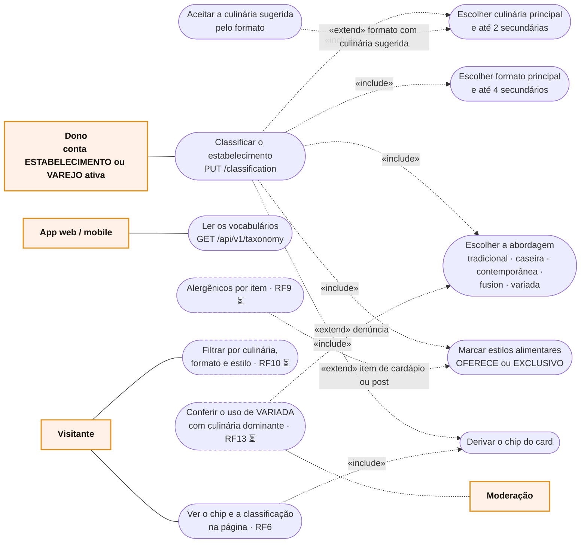

# RF7 · Casos de uso

Atores primários à esquerda, secundários à direita.

```mermaid
flowchart LR
    DONO["Dono<br/>conta ESTABELECIMENTO ou VAREJO ativa"]:::actor
    APP["App web / mobile"]:::actor
    VIS["Visitante"]:::actor

    UC1(["Classificar o estabelecimento<br/>PUT /classification"])
    UC2(["Escolher culinária principal<br/>e até 2 secundárias"])
    UC3(["Escolher formato principal<br/>e até 4 secundários"])
    UC4(["Escolher a abordagem<br/>tradicional · caseira · contemporânea ·<br/>fusion · variada"])
    UC5(["Marcar estilos alimentares<br/>OFERECE ou EXCLUSIVO"])
    UC6(["Aceitar a culinária sugerida<br/>pelo formato"])
    UC7(["Derivar o chip do card"])
    UC8(["Ler os vocabulários<br/>GET /api/v1/taxonomy"])
    UC9(["Ver o chip e a classificação<br/>na página · RF6"])
    UC10(["Filtrar por culinária,<br/>formato e estilo · RF10 ⏳"]):::planned
    UC11(["Alergênicos por item · RF9 ⏳"]):::planned
    UC12(["Conferir o uso de VARIADA<br/>com culinária dominante · RF13 ⏳"]):::planned

    MOD["Moderação"]:::actor

    DONO --- UC1
    APP --- UC8
    VIS --- UC9 & UC10
    UC1 -. «include» .-> UC2
    UC1 -. «include» .-> UC3
    UC1 -. «include» .-> UC4
    UC1 -. «include» .-> UC5
    UC1 -. «include» .-> UC7
    UC6 -. «extend» formato com culinária sugerida .-> UC2
    UC11 -. «extend» item de cardápio ou post .-> UC5
    UC9 -. «include» .-> UC7
    UC12 -. «extend» denúncia .-> UC4
    UC12 -.- MOD

    classDef actor fill:#FFF1E8,stroke:#E88F12,stroke-width:2px,color:#17120D,font-weight:bold
    classDef planned stroke-dasharray:5 4
```

A família do formato agrupa filtros e deriva o chip, mas não é selecionável como valor.
