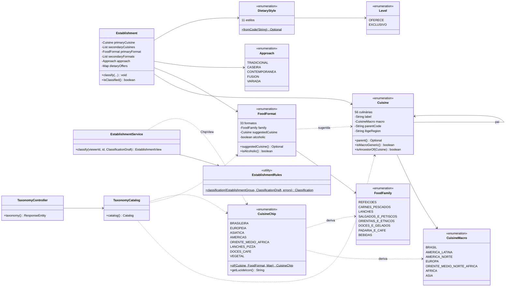

# RF7 · Classes

```mermaid
classDiagram
    direction LR
    class Cuisine {
        <<enumeration>>
        56 culinárias
        -String label
        -CuisineMacro macro
        -String parentCode
        -String ibgeRegion
        +parent() Optional
        +isMacroGeneric() boolean
        +isAncestorOf(Cuisine) boolean
    }
    class CuisineMacro {
        <<enumeration>>
        BRASIL
        AMERICA_LATINA
        AMERICA_NORTE
        EUROPA
        ORIENTE_MEDIO_NORTE_AFRICA
        AFRICA
        ASIA
    }
    class FoodFormat {
        <<enumeration>>
        33 formatos
        -FoodFamily family
        -Cuisine suggestedCuisine
        -boolean alcoholic
        +suggestedCuisine() Optional
        +isAlcoholic() boolean
    }
    class FoodFamily {
        <<enumeration>>
        REFEICOES
        CARNES_PESCADOS
        LANCHES
        SALGADOS_E_PETISCOS
        ORIENTAIS_E_ETNICOS
        DOCES_E_GELADOS
        PADARIA_E_CAFE
        BEBIDAS
    }
    class Approach {
        <<enumeration>>
        TRADICIONAL
        CASEIRA
        CONTEMPORANEA
        FUSION
        VARIADA
    }
    class DietaryStyle {
        <<enumeration>>
        11 estilos
        +fromCode(String)$ Optional
    }
    class Level {
        <<enumeration>>
        OFERECE
        EXCLUSIVO
    }
    class CuisineChip {
        <<enumeration>>
        BRASILEIRA
        EUROPEIA
        ASIATICA
        AMERICAS
        ORIENTE_MEDIO_AFRICA
        LANCHES_PIZZA
        DOCES_CAFE
        VEGETAL
        +of(Cuisine, FoodFormat, Map)$ CuisineChip
        +getLucideIcon() String
    }
    class Establishment {
        -Cuisine primaryCuisine
        -List secondaryCuisines
        -FoodFormat primaryFormat
        -List secondaryFormats
        -Approach approach
        -Map dietaryOffers
        +classify(...) void
        +isClassified() boolean
    }
    class EstablishmentRules {
        <<utility>>
        +classification(EstablishmentGroup, ClassificationDraft, errors)$ Classification
    }
    class EstablishmentService {
        +classify(viewerId, id, ClassificationDraft) EstablishmentView
    }
    class TaxonomyCatalog {
        +catalog() Catalog
    }
    class TaxonomyController {
        +taxonomy() ResponseEntity
    }
    Cuisine --> CuisineMacro
    Cuisine --> Cuisine : pai
    FoodFormat --> FoodFamily
    FoodFormat ..> Cuisine : sugerida
    DietaryStyle --> Level
    CuisineChip ..> CuisineMacro : deriva
    CuisineChip ..> FoodFamily : deriva
    Establishment --> Cuisine
    Establishment --> FoodFormat
    Establishment --> Approach
    Establishment --> DietaryStyle
    EstablishmentService --> EstablishmentRules
    EstablishmentService ..> CuisineChip : ChipView
    TaxonomyController --> TaxonomyCatalog
    TaxonomyCatalog ..> Cuisine
    TaxonomyCatalog ..> FoodFormat
    TaxonomyCatalog ..> CuisineChip
```

`Establishment`, `EstablishmentRules` e `EstablishmentService` pertencem ao [RF6](../RF6/README.md); aqui aparecem só
os membros da classificação.
