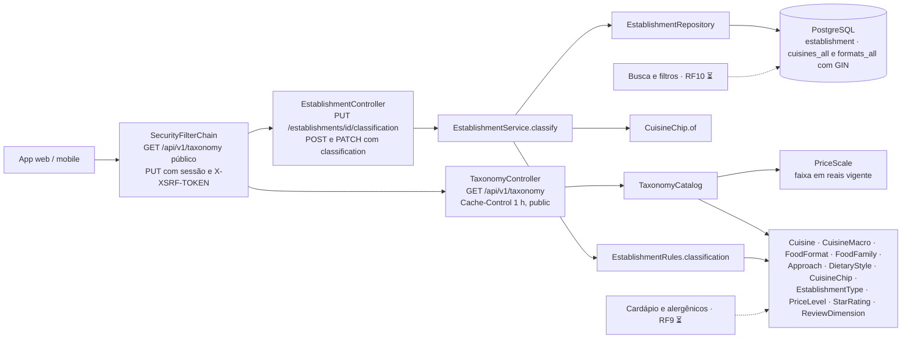

# RF7 · Componentes

```mermaid
flowchart LR
    APP["App web / mobile"] --> SEC["SecurityFilterChain<br/>GET /api/v1/taxonomy público<br/>PUT com sessão e X-XSRF-TOKEN"]
    SEC --> TC["TaxonomyController<br/>GET /api/v1/taxonomy<br/>Cache-Control 1 h, public"]
    SEC --> EC["EstablishmentController<br/>PUT /establishments/id/classification<br/>POST e PATCH com classification"]
    TC --> CAT["TaxonomyCatalog"]
    CAT --> ENUM["Cuisine · CuisineMacro · FoodFormat · FoodFamily ·<br/>Approach · DietaryStyle · CuisineChip ·<br/>EstablishmentType · PriceLevel · StarRating · ReviewDimension"]
    CAT --> PS["PriceScale<br/>faixa em reais vigente"]
    EC --> ES["EstablishmentService.classify"]
    ES --> RU["EstablishmentRules.classification"]
    RU --> ENUM
    ES --> CH["CuisineChip.of"]
    ES --> ER["EstablishmentRepository"]
    ER --> PG[("PostgreSQL<br/>establishment · cuisines_all e formats_all com GIN")]
    BUSCA["Busca e filtros · RF10 ⏳"] -.-> PG
    MENU["Cardápio e alergênicos · RF9 ⏳"] -.-> ENUM
```
