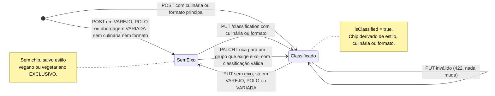
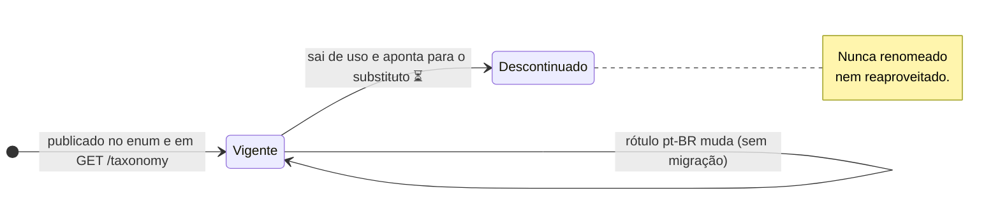

# RF7 · Estados

## Classificação do estabelecimento

```mermaid
stateDiagram-v2
    direction LR
    [*] --> SemEixo : POST em VAREJO, POLO ou abordagem VARIADA sem culinária nem formato
    [*] --> Classificado : POST com culinária ou formato principal
    SemEixo --> Classificado : PUT /classification com culinária ou formato
    Classificado --> Classificado : PUT /classification válido (substitui tudo)
    Classificado --> SemEixo : PUT sem eixo, só em VAREJO, POLO ou VARIADA
    Classificado --> Classificado : PUT inválido (422, nada muda)
    SemEixo --> Classificado : PATCH troca para um grupo que exige eixo, com classificação válida
    note right of Classificado
        isClassified = true.
        Chip derivado de estilo, culinária ou formato.
    end note
    note left of SemEixo
        Sem chip, salvo estilo
        vegano ou vegetariano EXCLUSIVO.
    end note
```

## Ciclo de vida de um código da taxonomia

```mermaid
stateDiagram-v2
    direction LR
    [*] --> Vigente : publicado no enum e em GET /taxonomy
    Vigente --> Vigente : rótulo pt-BR muda (sem migração)
    Vigente --> Descontinuado : sai de uso e aponta para o substituto ⏳
    note right of Descontinuado
        Nunca renomeado
        nem reaproveitado.
    end note
```
